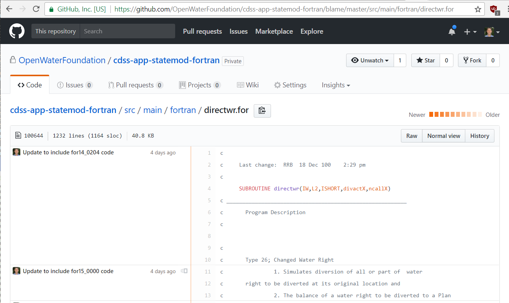
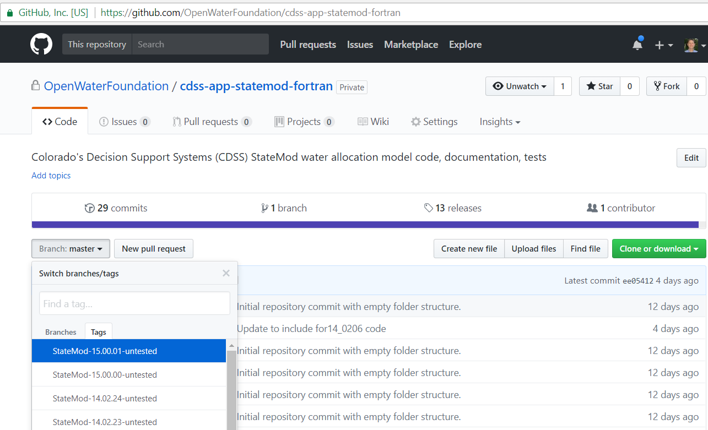

# Learn Git / Version Control Concepts #

This lesson focuses on version control concepts using examples from common technologies used in CDSS.
Basic Git concepts are introduced in the context of CDSS.

**Estimated completion time: 30 minutes**

* [The Difference Between Git and GitHub](#the-difference-between-git-and-github)
* [What is Version Control?](#what-is-version-control)
	+ [1. A repository](#1-a-repository)
	+ [2. One or more electronic files](#2-one-or-more-electronic-files)
	+ [3. Version identifier](#3-version-identifier)
	+ [4. The author/editor of the files](#4-the-authoreditor-of-the-files)
	+ [5. The time at which the edit was committed as a version](#5-the-time-at-which-the-edit-was-committed-as-a-version)
	+ [6. Commit message](#6-commit-message)
	+ [7. Embedded documentation](#7-embedded-documentation)
	+ [8. Branches, merging, and workflow](#8-branches-merging-and-workflow)
	+ [9. Published products](#9-published-products)
* [Version Control Examples](#version-control-examples)
	+ [Version Control Example - File](#version-control-example-file)
	+ [Version Control Example - Folder](#version-control-example-folder)
	+ [Version Control Example - Microsoft Word](#version-control-example-microsoft-word)
	+ [Version Control Example - Microsoft Excel](#version-control-example-microsoft-excel)
	+ [Version Control Example - Geographical Information System](#version-control-example-geographical-information-system)
	+ [Version Control Example - Google Docs](#version-control-example-google-docs)
	+ [Version Control Example - Dropbox](#version-control-example-dropbox)
	+ [Version Control Example - SharePoint](#version-control-example-sharepoint)
	+ [Version Control Example - CDSS Software](#version-control-example-cdss-software)
	+ [Version Control Example - CDSS Model Dataset](#version-control-example-cdss-model-dataset)
	+ [Version Control Example - CDSS Website](#version-control-example-cdss-website)
	+ [Version Control Example - HydroBase](#version-control-example-hydrobase)
	+ [Version Control Example - data.colorado.gov](#version-control-example-datacoloradogov)
	+ [Version Control Example - Git](#version-control-example-git)
* [OpenCDSS Approach Using Git and GitHub for Version Control](#opencdss-approach-using-git-and-github-for-version-control)

----

## The Difference Between Git and GitHub ##

Before focusing on version control concepts, it is important to explain the difference between Git and GitHub,
both of which are used in OpenCDSS.

Git is an open source version control system that provides a data management system for files.
Git also includes software tools to move files in and out of a version control repository.
"Git" refers to the version control system, and `git` refers to the command line program that executes Git commands.
Git is used by many open and closed source software projects.

GitHub is a company that provides cloud-hosting for Git repositories and other services.
GitHub is in some ways similar to Google Drive, Dropbox, and other cloud storage solutions,
although GitHub tends to build everything on top of the Git technology foundation.
GitHub is free for public (open source) projects, but private repositories require payment for hosting.
Popular alternatives to GitHub include Bitbucket and GitLab.

## What is Version Control? ##

What is "version control"?
Version control is a methodology by which versions of electronic content is tracked.
"Content" is one or more electronic assets, typically files on a computer.
Version control means that different versions are managed in a way that allows each version to be identified,
saved, retrieved, and compared with other versions.

Version control encapsulates the concepts described below.

### 1. A repository ###

Electronic files (assets) must have a home in which to be managed.
Git and other version control systems use a "repository" to manage versions of files.
The term "repository" is a fundamental concept and Git users will typically refer to multiple repositories
that correspond to different software tools or other file collections.  The term "repo" is an abbreviation for repository.
Git tracks files in a special `.git` folder in a repository folder.
Files and folders that have names starting with a period are hidden on Linux but are visible in Windows.

Version control systems built on internet technologies use the term "remote" to mean a repository hosted on a remote server, such
as a server hosted in the cloud on GitHub, and "local" to mean the files on a local computer such as a desktop or laptop computer.

A more advanced concept is that of "centralized version control system" and "distributed version control system".
In a centralized version control system, a server maintains the full history of versions and allows a single version to be
checked out for editing.  Older version control systems used this design.
Cloud storage system such as Google Drive and Dropbox also use this concept since the local computer has only the most recent copy.

Git, in contrast, is a distributed version control system and allows the entire history of changes to be saved in the local repository copy.
This has a number of advantages including providing distributed backups in case of a server crash,
allowing longer local development efforts to occur over multiple incremental updates (before committing to the server),
and allowing local comparison with the history, rather than having to retrieve that information from the remote server.

Remote repositories hosted on GitHub can be private, meaning that the repository administrator controls who has access
to the repository, and public, meaning that everyone can see (read) the repository.
In both cases, the repository administrator can designate who has write access to the repository.

Information about transferring copies of files between local and remote repositories is presented in later lessons.

OpenCDSS repositories are hosted on the [OpenCDSS GitHub account](https://github.com/OpenCDSS).
CDSS software repositories have names that start with `cdss-`.
OpenCDSS repositories are named somewhat verbosely to indicate the type of content,
a specific product name, and programming language.
This helps repository users understand the repository contents from the name.
As OpenCDSS evolves, it is expected that these repositories will be transferred to a State of Colorado
agency GitHub account.

The CDSS GitHub repositories can be accessed using a web browser.
Some CDSS repositories are private until licensing and other issues can be resolved, and therefore require
that the repository maintainer give access permissions.
When access is granted, the GitHub website can be used to explore repositories and understand concepts presented
in this documentation.

### 2. One or more electronic files ###

Version control can of course be applied to a single file,
as some of the examples in this lesson will illustrate.
However, one of the strengths of Git is that it allows version control to track groups of files.
This means that changes to a group of files can be associated with a larger task.
For a software project, a new feature or bug fix may consist of changes to multiple files.

The repository in its entirety consists of a group of related files.
Although many types of files can be managed in one repository,
it is customary to create repositories that correspond to some logical group of files, such as for a software tool,
a document, or scripts that control a data-processing workflow.
The granularity of the repository allows for controlling access permissions and aligning the repository
with contributors that have skills for the repository contents.
For example, a software program is typically written in one language and therefore the repository would
contain that program's files and be configured to work with the software development tools for the programming language.

It is customary that a repository will contain only original content and not derived content that can be regenerated.
For example, software source code text files are saved, but the binary files that result from a compiler process are
not saved in the repository.
This ensures that the repository size does not grow too fast.
Derived files may also vary by developer based on subtleties of different development environments,
for example files compiled on Windows or Linux.

Repositories work best for text files because it is easy to view and compare such files.
However, there are times when it is necessary or desirable to track binary files in a repository, including:

* image files used in software (button icons, branding, or other user interface elements)
* binary data files used in testing
* binary library files that are "frozen" with a software version (note that modern development environments
provide solutions to overcome this approach, for example Maven for Java, and NPM for JavaScript)
* binary Microsoft files such as Word and Excel files, used for documentation, data, etc.
* PDF files that are important to retain

Binary files are more difficult to compare and consequently it is more difficult for Git users to known which
version of the file may be correct.  Git provides a way (`.gitignore` files)
to ignore files so that binary files can exist in working files
but are not committed to the repository (discussed in a later lesson).

Various version control systems use different approaches to store files.
Whereas some version control systems store the differences from one version of a file to another,
presumably to save space, Git stores the entire file each time, which allows files to be directly
accessed rather than having to replay a sequence of changes to create the current file.
This also allows files to be moved and renamed while retaining the history.
Git does compress files in its internal storage format.

### 3. Version identifier ###

Version control requires that the version have a unique identifier.
Git uses the term "commit" to mean a version of files that were saved to the repository at the same time.
Each commit has a unique identifier, a [SHA-1 hash](https://en.wikipedia.org/wiki/SHA-1),
which is a unique character sequence determined from the files.
Git internally tracks the state of the repository and uses the SHA-1 commit identifiers to build the history.

It may also be useful to assign a more general version to files in a repository,
such as a software product version that is tracked in release notes.
Such a version is typically an increasing number.
For simple products, such as a file, the version may be `ver1` or perhaps use the date.
For a software product the version may be more complex such as `MajorVersion.MinorVersion.MicroVersion` and
often also includes a date.
Such a version is in many cases represented in the source files (such as version in software code that can be printed
using the `-v` or `--version` option) and Git
also provides a way to "tag" a commit with a version identifier.
This is discussed in a later lesson.

### 4. The author/editor of the files ###

Version control systems need to know which user has permissions to commit to a repository,
who edited files and committed changes, and which user's edits are in conflict (so that coordination
of such conflicts can be resolved).

If using software such as Microsoft Word, the user information is taken from the computer operating system account.
However, Git uses separate user identifier information.
A GitHub account is required to fully engage in using Git, although anyone can access public GitHub repositories.

A GitHub account and email is associated with a user, and that user can contribute to many repositories across
multiple organizations.
This approach allows a person to contribute to many software projects.
A GitHub user might have multiple accounts if necessary, for example one for personal projects and another
for work projects.  A repository's administrator(s) controls which users have access to a repository.

### 5. The time at which the edit was committed as a version ###

Every change that is committed to a repository is automatically given a timestamp, based on the computer's time.
The timestamp can be used to create a chronological history of changes.
Because commit identifiers use a SHA-1 hash, which is not a sequential number,
the timestamp can be easier to understand when reviewing a repository's commit history,
but the commit identifiers will need to be used for granular Git operations.

### 6. Commit message ###

Changes to file contents managed by a version control system are like any other edits...they can be well-explained or they
can be a confusing mystery.
A "commit message" is simply a comment that is saved with a commit that explains the change.
Depending on whether changes to one file or multiple files are saved in a commit,
the commit message may be very specific (e.g., "fixed divide by zero in abc function") or more general
(e.g., "fixed bug where calculation did not occur on leap years, which impacted several functions").

The `git commit` command requires a commit message but does not check its content.
Consequently, it is the duty of a committer to provide a thoughtful commit message.
By convention, a multi-line commit message is recommended, where the first line is a summary message,
then an optional blank line and more detailed explanation.
Different Git tools use this information in output.

Legacy CDSS software source code files may include a long history of changes, for example in the `statem.for` main program.
These comments are no longer needed when using a version control system such as Git,
but may be maintained for some time as Git version control is phased in.
Instead, Git (and GitHub) provide features to show the edit history.
For example, the following is output from the GitHub `blame` view for a source code file,
and indicates the latest edit to each line of the file.

Legacy CDSS software source code files may also contain inline comments that provide a
"bread crumb trail" or other information (e.g., "According to Joe Smith, increment by X so that...").
These comments are perfectly valid and can remain in code as they help explain logic
and improve the efficiency of future coding activities.
However, it is no longer necessary to embed a running history of change comments since that history
will be tracked by Git.

### 7. Embedded documentation ###

It is common that a repository will include embedded documentation, such as README files in folders.
These files explain the contents of the repository.

GitHub and other version control systems prefer using `README.md` files, which are
text files that contain Markdown syntax.
Markdown (see:  [GitHub Guides:  Mastering Markdown](https://guides.github.com/features/mastering-markdown/))
allows simple text files to be edited to include formatting information.
The GitHub website (and other software) will then format the file for viewing.
OpenCDSS developers should get in the habit of creating `README.md` files to help explain the contents of the repository.

### 8. Branches, merging and workflow ###

A major feature of version control system is the concept of branches.
A branch is simply a version of a file (or set of files) that diverges from a starting point and has its own history.
For example, a software developer may create a branch to work on a bug, thoroughly test the bug,
and then merge the updated code into the main branch.
Once the branch is merged, it can be deleted, thereby minimizing clutter in the repository.
Branches might be created to work on bugs, new features (enhancements), to test an idea, or other reasons,
and typically are named accordingly.

GitHub provides an online issues tool for each repository that can be used to report bugs,
request enhancements, and ask questions.
The sequential number for the issue is a convenient identifier to name a branch.
For example, a branch to fix a bug might be called `9-bug-divide-by-zero`.

In Git the default main branch is named `master` and is therefore referred to as the "master branch".
Branches can exist in a local copy of a repository, the remote (in GitHub), or both.
For collaboration, multiple remote repositories may be used, for example to allow contributions from
multiple contributors.

Branches can also have a long life and may never be merged with the master.
For example, if the master branch represents the most up to date working code,
it will always be moving forward as bugs are fixed and new enhancements are added.
However, it may be necessary to go back to an earlier version and fix a bug,
for the case where a software user must use the old version and cannot use the most recent version.
In this case a "stable version" branch can be created that implements necessary bug fixes but otherwise
does not attempt to catch up to the current master branch.
The bug will also have been fixed in the master at some point in time.

Merging branches results in some complexities, in particular when multiple people are editing the same files,
and merge conflicts result.
Git provides features to help with merging (discussed in later lessons).

The act of branching, editing, and merging is encapsulated by the term "workflow".
Everyone participates in one or more workflows in their daily work.
However, using Git naturally enforces a more formal workflow, and each project/repository should adopt
a workflow that supports collaboration.
The workflow for OpenCDSS projects is discussed in more detail in later lessons.

### 9. Published products ###

If only source files are maintained under version control,
how does one go about producing finished products?
A repository typically will contain content that supports the workflow processes,
such as scripts that automate execution of tasks, including compiling, running tests, creating final products, etc.
The automation tools will typically create one or more products, which can then be made available in
appropriate form, such as software installer, online documentation, dataset, etc.

The version of the released products are typically coordinated with "tags" in the repository so that it is
possible to exactly match the point in time (commit) when source code agrees with a released product.
The following image illustrates how tags can be assigned to different software versions:

It is also helpful to include release notes with a product to describe changes in the product for each released version.

## Version Control Examples ###

The following sections illustrate version control challenges for common content and technologies used in CDSS.
The corresponding approach in Git is discussed to provide context.

If a file type is not specifically discussed, it is likely that an example that is discussed will be similar.

### Version Control Example - File ###

The simplest form of versioning is for a single file.
For example, a configuration file might include the date/time in the filename (`config-20170923.cfg`).
Or a backup may include a simple version number (`somefile-ver1.txt`).

When using Git, such versioned files no longer need to be created.
The original filename without version information can be used and changes over time will be available in the repository.
Git provides versioned backups so that developers can focus on moving forward.

### Version Control Example - Folder ###

A versioned folder is similar to a versioned file.
For example, a folder used to save a version of software might include the version number (`statemod-14.01.01`).
Or a backup may include the date (`docs-20170923`).

When using Git, such versioned files no longer need to be created.
The original filename without version information can be used and changes over time will be available in the repository.
If necessary, a tag can be used to mark an important version.

### Version Control Example - Microsoft Word ###

Microsoft Word files can be versioned similar to other files by including a version in the file name.
Additionally, Word files provide internal versioning that may help new Git users understand version control.
Word files can be edited with the tracking feature turned on.  This will show "red line" markup in the file,
with the editor's name and a time.  The edit tracking feature allows a file to be passed from one author to another
in order to create the final document.

The act of accepting or rejecting edits (by using Microsoft Word features) is similar the branch merging process
that is used with Git.  Similar to how a Git repository will have a maintainer with write permissions, it is likely
that the Word file will have a primary author whose job it is to review and merge the edits.
Anyone that has worked with versions of Word documents that have diverged knows how painful it can be to rectify the
different versions if edit tracking is not used.
The features of a version control system can help with collaboration, although
doing merges on binary files such as Word documents presents challenges.
Collaborating on text files is simpler.

Word files can be committed to a Git repository.
However, because they are binary files (actually, a special zip file that includes complicated text and binary files),
special commands must be used to compare the files.
Authors can also coordinate so that they know which versions should be committed to the repository,
for example, by incrementing a version and/or date in the file header or footer.

This documentation, which uses text Markdown files and the MkDocs software, is an example of 
how documentation can be created using formats other than Microsoft Word.

### Version Control Example - Microsoft Excel ###

Microsoft Excel files are similar to Microsoft Word files in that they are a complex binary format.
Excel files can be versioned by including a version in the filename.

Excel files also provide ways to implement internal versioning, for example:

* Include a worksheet in the workbook called "Change Log" or similar with columns "When", "Who", "What" to
summarize a history of changes.  This is a good best practice if the Excel file history needs to be understood
external to the version control system.
* Comments can be added for cells to indicate changes.  This may be appropriate as a form of red-lining for review,
but is not practical to maintain a long history of changes.
The comments will often be removed after review.

Excel files can be stored in Git, for example as test data or documentation,
as long as the pitfalls of doing so are understood, mainly issues with comparing versions.
An alternative to storing Excel files in Git is to save the data as comma-separated-value file.
This file can still be viewed/edited by Excel later, but cannot store Excel formatting features.
CSV files are appropriate for simple data files that do not require formatting.

### Version Control Example - Geographical Information System ###

Geographical information system (GIS) data (also referred to as spatial data)
consist of layers, map configurations, and other files.
Layer data can have many forms, including simple comma-separated value (CSV) files
for point data, text files such as KML or GeoJSON, and binary files such as shapefiles and geodatabases.
Some layer formats such as GeoJSON are encapsulated in a single file, whereas others require multiple files (e.g., shapefile).
Spatial data may be used for automated testing or may be included in a model dataset and therefore may be added to a Git repository.

Similar to other files, GIS files may be versioned by including a version number or date in the filename
or layer name.  Advanced GIS systems also provide internal versioning to track edits to layer data over time.

GIS layers generally support the concept of metadata.
For example, an `*.xml` file can be distributed with a shapefile to provide information about the layer.
Metadata often includes information about the data version.

It is recommended that care be taken when tracking GIS files in version control as such files can be large.
It may be appropriate to instead version the scripts and configurations that are used to create GIS files with
processing software.

### Version Control Example - Google Docs ###

Google Docs provides the ability for multiple people to collaborate, including editing a document simultaneously.
The document content lives in the cloud on a Google server.
See more information in [G Suite Learning Center - Get started with Docs](https://support.google.com/a/users/answer/9300503?hl=en&sjid=7515127222703140140-NA)

Note that it is possible with GitHub to edit content with a browser via the GitHub website, assuming
that access is granted.
However, most projects that use Git rely on editing on the local computer.
Google Docs is useful for collaborative editing; however, it is not appropriate for editing software code.

### Version Control Example - Dropbox ###

Dropbox provides cloud hosting services for file storage and is similar to other services such as Google Drive, Box, etc.
The Dropbox client software synchronizes files on the local computer with files on the Dropbox cloud server,
with synchronization triggered by saving or deleting a file.
Other users with access to the file then will see a copy of the file on their computer.
Dropbox tracks versions of files and the history can be viewed by using the Dropbox website.
An option is available at higher cost where Dropbox will maintain a perpetual history of file versions, in case an old
version needs to be retrieved or restored.
Dropbox's automatic versioning does not merge contents when more than one person edits files at the same time.
Instead, it will create multiple copies of the file and indicate that a conflict has occurred by modifying the filename.
Dropbox users must then sort out version issues.
As with simple versioning, files and folders can be named with a version, in which case Dropbox will track each of the files.

Dropbox does not provide sufficient version control for software projects and model datasets but may be used to publish packaged datasets.

### Version Control Example - SharePoint ###

Microsoft SharePoint is a technology solution that is often used by businesses to share documents and control
document review processes within an organization. 
SharePoint provides features to track versions of files.
The SharePoint solution is not discussed in detail here.

SharePoint does not provide sufficient version control for software projects and model datasets but may be used to publish packaged datasets.

### Version Control Example - CDSS Software ###

CDSS software has been maintained in version control in different ways.
StateMod and StateCU have been maintained in folders with version and/or date.
Each versioned folder contains and archive of code version.
The OpenCDSS effort has saved a limited number of historical versions in Git/GitHub as the starting point of
using a new open source development environment.

TSTool, StateDMI, StateView, and StateMod GUI were initially maintained in SVN version control and have been
migrated to Git/GitHub.
Additional changes to the development environment will occur in OpenCDSS to use the latest technologies.

The repositories are configured to ignore dynamic files such as compiled versions and only source code
and other needed input are saved in the repository.  A high level workflow for software development is:

1. Save code and other needed files in the repository (in GitHub)
2. Publish executable versions of the software and documentation (for example on CDSS website)

### Version Control Example - CDSS Model Dataset ###

A model dataset, such as StateMod dataset, has in the past been versioned using a versioned folder,
but has not used GIt.
It is also common in CDSS that the filenames in a dataset may contain version information, such as
`cm2015` indicating the StateMod Colorado River model containing data through 2015.
This approach clearly identifies the version of the files tied to the ending year of the dataset.

Because Git allows versioned groups of files to be maintained over time,
it is possible to simplify model dataset names to a more generic form, such as `cm`.
However, doing so would require a change in protocol, such as adding README files with the version.
The dataset could continue to be packaged in a zip file that contains the version number (e.g., `cm2015.zip`),
similar to the current approach.
The historical approach should be evaluated to determine if changes will be made.
It is possible to use a compromise solution where the files use a generic name such as `cm`,
and the workflow processes create versioned installation products such as `cm2015.zip`.

Repositories generally only contain the original source files and do not contain any files that are
dynamically created.  Consequently, model dataset repositories should only contain input data,
configuration files, command files, and data processing scripts.
The overall workflow might be:

1. Save input data in the repository (in GitHub)
	- save data from third-party sources as input files in the repository
	- edit and save control files such as model configuration files
2. Save Data processing control in the repository (in GitHub)
	- edit and save TSTool and StateDMI command files
3. Publish full input datasets (CDSS website)
	- after running the data management interface tools (TSTool, StateDMI), publish the dataset as a zip file
	so that others can run the models
4. Publish fully executed (has not been done, perhaps use State's Google Platform or OWF website as test)
	- after running the entire model, publish the input files and output files so others can directly use the
	files without rerunning

### Version Control Example - CDSS Website ###

The [CDSS website](http://cdss.state.co.us/Pages/CDSSHome.aspx) provides downloadable content including
"Software Products", "Modeling Data", "GIS Data", and "Documents".
In most cases, only the most recent version of a product is available,
although multiple versions of some software is currently available.

The CDSS website focuses on usable products such as runnable software and model datasets that can be run in software,
assuming that the software user has required understanding and skills.
The CDSS website does not provide source code or versions of model files.
Using a version control system such as Git/GitHub is appropriate for developers of the products,
but public consumers of the products require packaged products.

The approach that will be followed as OpenCDSS is implemented is to automate creation of CDSS website products
by using scripts and batch files within the development environment.
The packaged versions as zip files or other formats can then be placed on the CDSS website for download.

Inversely, model datasets that are published on the CDSS website (or other websites) will be used in
automated software testing.
The complexity of datasets requires that multiple levels of testing occurs and published, quality-controlled datasets
supports the most complex level of testing.

### Version Control Example - HydroBase ###

HydroBase is DWR's main database for water-related data, in particular for administrative data including
water rights and diversion records.
Several versions of HydroBase are maintained within the State's system, each with different focus.
For example, one version is used for administrative tasks and the CDSS version is updated for use by CDSS.
The [CDSS Online Tools](http://cdss.state.co.us/onlineTools/Pages/OnlineToolsHome.aspx)
provide web access to HydroBase, using the most recent published HydroBase version.
Versions of HydroBase are also [available for download as SQL Server databases](https://dnrftp.state.co.us/#/DWR/Modeling/HydroBase/).

An important issue is that automated software testing for programs that interact with HydroBase must
coordinate test configuration with the HydroBase version.
Ideally, software can be written to be backward compatible for different versions of HydroBase, and software should
definitely work with the most recent version(s) of HydroBase.

Git branches, commits, etc. should indicate which version of HydroBase is relevant when changing code due to a HydroBase issue.

### Version Control Example - data.colorado.gov ###

The [Colorado Information Marketplace (CIM), data.colorado.gov](https://data.colorado.gov/) website provides an open data portal
for datasets.
The "Water" section of the website provides 20+ datasets related to water (and many variations based on queries, maps, charts, etc.).

CIM datasets typically do not reflect versioning as if a work in progress.
Instead, CIM datasets may include an effective date to indicate when the data apply.
For example, municipal boundaries and census data are published as datasets with a year in the dataset name.
Datasets that are updated frequently, such as river calls, are a snapshot of the most recent published data; therefore,
it would be necessary to download the dataset every day and archive offline in order to compare different snapshots.
Data portals like CIM typically cater to data consumers with basic needs and complex analyses, such as tracking
data changes over time, may require more complex tools to access and use the data.

CIM may be appropriate for publishing some CDSS datasets, as a way of increasing public access.
However, the complexity of CDSS spatial layers and model datasets may not integrate well with CIM's features.
 
## OpenCDSS Approach Using Git and GitHub for Version Control ##

The previous sections illustrated version control concepts for many different file formats and technologies
that intersect CDSS.
In some cases, version control is integrated with the file format, but in many cases version control
relies on maintainers of the files to implement a version control solution.

Git and GitHub have been selected for OpenCDSS and have the following benefits:

* widely-used for software and other projects
* free, open source Git client software (and also commercial versions for those who prefer) 
* significant documentation, training resources, and examples
* integration with various software development tools
* provides opportunities to use version control on a variety of content including software, datasets, documentation,
and workflow processes

At the same time, use of Git and GitHub have the following challenges:

* learning curve for working knowledge
* additional learning curve to become highly proficient
* imposes a level of rigor for version control that has not been used before in CDSS, which requires a paradigm shift

With the above benefits and challenges in mind, the following approach is being implemented for OpenCDSS.
Adjustments will be made over time to reflect experience on OpenCDSS software projects.

1. **Git/GitHub training**:
	The OpenCDSS project does not have budget to fund a significant Git/GitHub training program.
	This documentation has been prepared as a Git/GitHub training resource for CDSS stakeholders that have
	little or no Git/GitHub skills.  However, it is expected that those who wish to engage in OpenCDSS
	development and contribute to software will educate themselves to a large degree by reading web resources,
	experimenting with Git/GitHub, and through experience on other projects that use Git.
	The OpenCDSS team will try to help by answering questions and enhancing
	training materials.  It is assumed that regular contributors to OpenCDSS will have achieved
	a high proficiency with Git/GitHub and follow conventions of the OpenCDSS software projects.
2. **GitHub organization account**:
	The [OpenCDSS Organization Account](https://github.com/OpenCDSS)
	account is used for CDSS repositories.
	+ All repositories on this account use open source licenses and are public.
	+ Uses of the account is coordinated with the CWCB and DWR.
3. **GitHub developer accounts**:
	Individual developers that use GitHub and expect to contribute to OpenCDSS
	projects via GitHub should sign up for personal GitHub accounts.
	+ Account names can be a personal choice, although some organizations may have recommendations.
	+ The email associated with the account can be a personal choice, although using an email associated with the
	organization working on CDSS projects is helpful.
4. **Repository Contents**:
	+ Repositories will exist for each major CDSS software tool (StateMod, StateCU, etc.)
	+ Where components are shared, products may rely on multiple repositories.  For example, TSTool relies on multiple
	repositories because components are shared with StateDMI and other software.
	+ Repositories are also used for documentation and model datasets.
	+ Repository configuration is compatible with the primary development environment tools and
	implements best practices for the content of the repository.
	+ Repositories include `README.md` files to provide information about the repository contents.
	Therefore, repository maintainers are expected to have at least a basic undersanding of Markdown for documentation.
	+ Each repository/product will be maintained by one or more GitHub users that have write privileges for the
	repository.  The maintainers must have proven that they have understanding of the software code and
	development environment, as well as having sufficient Git/GitHub skills.
	+ All other contributors will need to provide contributions via GitHub pull requests, GitHub Issues web page,
	or other input to maintainers.
5. **Integrated Development Environment Tools**:
	Development tools such as Eclipse save configuration files with software projects.
	The approach initially taken for OpenCDSS is to save Eclipse project settings
	(.e.g., `.project` file, `.cproject` file, and `.settings` folder) in the repository in order
	to facilitate environment setup.
	A different approach may be taken in the future that will require more effort from developers to
	configure their development environment but would provide more flexibility.
	This topic will be evaluated as multiple development environment tools are implemented over time by different
	contributors.
6. **Git Utilities**:
	See the `build-util/git*` utilities in the main repository for a product for useful Git utilities,
	which are useful when multiple repositories comprise a product.

The remainder of this documentation focuses on teaching Git/GitHub skills that will result in proficiency needed for OpenCDSS.
