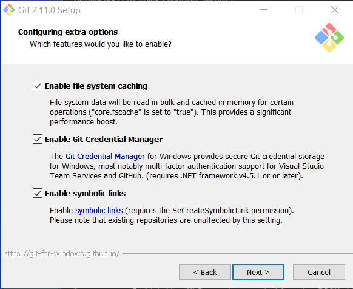

# Install Git Software / Command Line Software

Git command-line tools are useful when using Git commands from a shell/terminal/console window.
The following choices will also install stand-alone graphical user interface (GUI) tools
that can be used instead of command-line tools.
However, command-line tools are used in many of the examples in this documentation.

See also the [Getting Started - Installing Git](https://git-scm.com/book/en/v2/Getting-Started-Installing-Git) documentation.

The following are sections in this page:

* [Install Git on Cygwin](#install-git-on-cygwin) - Cygwin is a useful Linux-like environment that runs on Windows,
but is not currently used in CDSS development environment
* [Install Git on Linux](#install-git-on-linux) - the CDSS software development environment is being enhanced to support Linux
* [Install Git on Windows (Git for Windows)](#install-git-on-windows-git-for-windows) - **current recommended CDSS environment**

----------

## Install Git on Cygwin

Install Git on Cygwin using the normal Cygwin setup program and select the git tools from the ***Devel*** software group.

## Install Git on Linux

Install Git on Linux using:

```
$ sudo apt-get update
$ sudo apt-get install git-all
```

## Install Git on Windows (Git for Windows)

Git for Windows is available as a standard installer and includes Git Bash (a Linux environment), Git CMD (a Windows command shell),
and Git GUI (an interactive Git client).
This software also installs a copy of [Minimalist GNU For Windows (MinGW)](http://www.mingw.org/wiki/Getting_Started),
in order to provide command-line Bash shell functionality.
This is relevant because other development environments, such as GCC/gfortran on Windows may use another copy of MinGW.
It is OK to have multiple versions of MinGW installed if disk space is available,
but software developers will need to understand which MinGW shell is being used.
Confusion can be avoided by using the ***Start*** menu to open the correct command shell.

Determine whether Git for Windows is installed by looking for Git in the ***Windows Start*** menu.

The following is the installer for Git for Windows, which will install
the command-line Git Bash shell, Git CMD, and interactive Git GUI.

* [Git for Windows Download](https://git-for-windows.github.io/) - 64-bit Windows installer

The following example installs Git on Windows 10.  Run the installer.


Research indicates that although it may be possible to install Git software in another folder,
installing under the user files may be only option, so use the default.
This may be necessary to ensure that a user's Git settings are specific to the user.


The following setting is recommended and will require using Git Bash or Git GUI from the ***Windows Start*** menu.


The following setting ensures that text files in the Git repository will end with LF character and allow
files on the file system to use normal Windows CRLF characters.
This facilitates collaboration between developers on different operating systems.


The following setting provides better behavior when using Git Bash.


The following settings allow for advanced use, although that is not expected on this project.



Do not use experimental features.


After installing:

* the Git Bash can be run from the start menu to provide a Linux-like terminal window to run Git commands with the `git` program
* Git CMD can be run to provide a Windows command window to run Git commands with the `git` program
* Git GUI can be run to provide an interactive interface

The Git for Windows software install folder varies depending on the Git for Windows version,
operating system, and user.
To determine where the software is installed, open Git Bash and show the current folder.
For example, the following output is from an older Windows 7 installation,
and reviewing the installation folder does not show a MinGW folder (all files are in a `bin` folder).

```sh
$ git --version
git version 1.9.4.mysysgit.2

$ cd /
$ pwd -W
C:/Program Files (x86)/Git
```

The following is output from a Windows 10 installation.
Reviewing the folders shows a `mingw64` folder, under which exist programs that can be run in Bash.

```sh
$ git --version
git version 2.11.0.windows.1

$ cd /
$ pwd -W
C:/Users/sam/AppData/Local/Programs/Git
```

## Next Steps

After installing Git, the software needs to be configured to reflect developer name and preferences.
