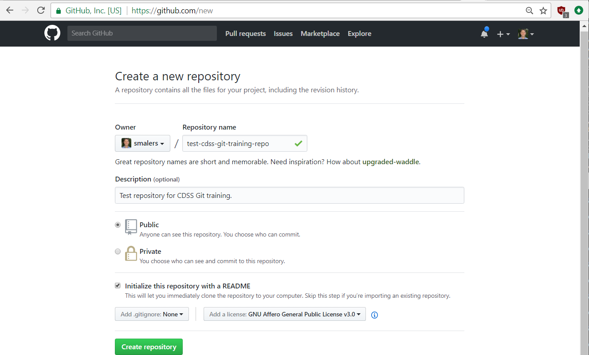
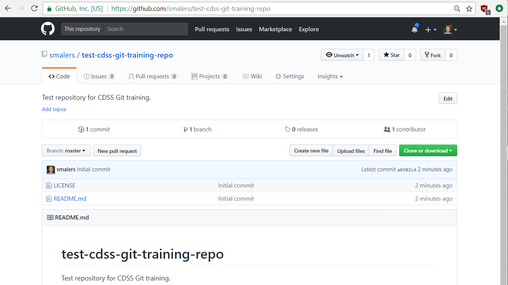
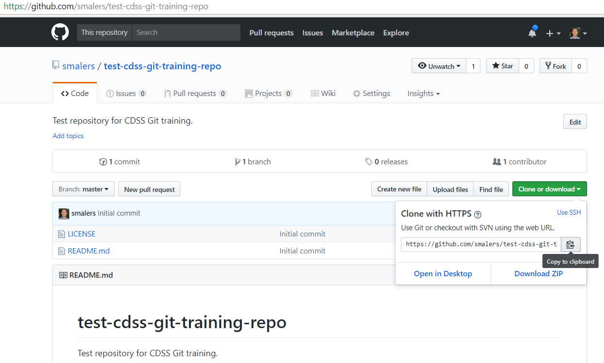
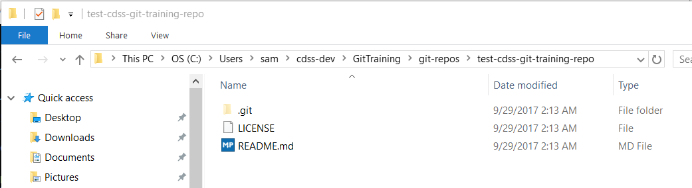

# Learn Git / New Repository #

To begin using version control using Git it is first necessary to create a new repository.
This lesson explains how to create a repository on GitHub and clone it to the local computer using a personal repository.
Information about renaming, deleting, and backing up the repository is also provided.

**Estimated completion time:  30 minutes**

This page includes the following sections:

* [Login to GitHub](#login-to-github)
* [Create a Repository](#create-a-repository)
* [Clone the Repository to a Local Computer](#clone-the-repository-to-a-local-computer)
* [Rename the Repository](#rename-the-repository)
* [Delete the Repository](#delete-the-repository)
* [Backing up the Repository](#backing-up-the-repository)

You may also find the GitHub training documentation useful.
However, making all edits on the GitHub website is simplistic because in more complex projects such as
software development there is a need to test the work and not simply rely on visual confirmation of edits on GitHub.

* [GitHub Hello World](https://guides.github.com/activities/hello-world/)

-------------

## Login to GitHub ##

When creating a Git repository, it is recommended to create the empty repository on GitHub.
Creating the repository on GitHub and then cloning to the local computer will automatically
ensure that the repository settings for the clone are compatible with the GitHub remote repository.
You can also create a repository on a local computer and then load to GitHub, but that process is not explained here.

Note that repositories can be created in your personal account on GitHub.
However, repositories in an organizational account can only be created by a GitHub user
with administrative/create privileges for that account.
The maintainer of a repository will typically grant permissions to users based on their role on a project team.
For example, users that should be able to modify the repository are given write permission whereas
collaborators that can't directly update the repository will be given read permissions (read is the default for
public repositories).

Login to GitHub using a web browser and URL `https://github.com/`.  Select the ***Sign in*** link.

If this is the first time using GitHub, sign up for an account you must
[create an account](../01-lesson-github-account/lesson-github-account).

## Create a Repository ##

After logging in, the GitHub website will provide an option to ***Start a Project***.  Click on this button/link.
Or, look for a ***New Repository*** button/link lower on the page.
Note that in GitHub "Start a Project" is equivalent to creating a new repository whereas on some other Git cloud sites like
[Bitbucket](https://bitbucket.org/produc://bitbucket.org/product) projects are a layer above repositories.

Fill in the information for a new repository similar to below and press the ***Create repository*** button/link,
with the following considerations:

* **The repository name should be unique enough to avoid confusion.**
The name only needs to be unique within the account, in this case a personal account.
However, it is often useful that the repository name should be unique in the world, to avoid confusion.
For example `test` may be unique within the personal account,
but an organizational account used for public repositories may use longer names.
The Open Water Foundation has initialized CDSS software repository names with longer names that include `cdss` at the start.
* **The repostory should be public to avoid GitHub costs.**
Private repositories can also be created, and for this training public is OK.
* **Initalize the repository with an initial README file.**
Doing so prevents some issues later and using a README is a best practice.
* **Initialize with a `.gitignore` file.**
This file provides useful information about files to ignore, such as ignoring compiler dynamic file output.
This file is discussed in the next lesson so it is not necessary to create now (but go ahead if you want to
experiment with a specific language).
* **Initialize with a license file.**
A license can be selected to indicate how others may distribute and use the content of the repository.
The GPL version 3 license is selected below.
Licenses are being determined for OpenCDSS projects.
In addition to software projects, licenses can be specified for repositories that contain
documentation (like this training documentation), model datasets, and other content.
For example, [Creative Commons](https://creativecommons.org/) licenses may be appropriate for general content.



The GitHub webpage will then appear similar to the following image.

* The current location within the repository is indicated at the top, in this case `smalers/test-cdss-git-training-repo`,
and can be used to navigate folders within the repository (in this case no folders are present).
* Files are listed for the currently selected folder (in this case the top folder).
* If a `README.md` Markdown file is present, its contents will be shown by default.
It is good practice to create such files in folders to help understand the repository contents.
See the [GitHub - Mastering Markdown article](https://guides.github.com/features/mastering-markdown) for more information.



## Clone the Repository to a Local Computer ##

It is possible to work with files directly through the GitHub website, including adding files and editing files.
However, doing so is generally not the best approach for software development because it is necessary
to compile and test programs in the local computer environment.
Therefore, the next step is to clone the GitHub repository to a local computer.

Note that the term "fork" is also used with GitHub and version control in general.
A fork is a clone of a repository intended to represent a separate copy of the repository.
This is necessary when a user does not have write permission in a repository and must make their own copy
to make changes, or, in an extreme case, when someone wants to take a project in a new direction.
Open source software projects try to avoid forks because it is best to evolve a project rather than give up and start over.

### 1. Create a Folder on the Local Computer ###

The local computer copy of the repository is where day-to-day work will occur.
By default, the cloned repository files will exist in a folder that has the same name as the repository
and it is recommended to use this default to avoid confusion.
It is a personal choice as to where repository folders exist within parent folders on a computer but it
is recommended that some convention be followed to avoid confusion.
Note that Git repository folders will always contain a folder called `.git` and existence of such a folder can be used as a clue to
understand whether the folder is for a repository.

The following are ideas for organizing repositories:

* Create a single folder for all repositories, for example `git-repos`.
This is simple, but may be confusing once many repositories are created.
* Create folders by category, client, system, product, etc., perhaps with multiple layers.
For example, if work is on a project, the repository folder might be within that project's root folder.
If work is on a product, the repository folder might be within that product's root folder.

The Open Water Foundation has settled on a convention where multiple folders are used to represent a focus, product, and then repository.
For example, for CDSS, the folder structure is similar to the following on Windows.
Note that saving repositories in a user-specific location (rather than for example a shared network location `N:\shared-repos`)
is desired because it may be confusing if
multiple developers are working on the same files.
Git overcomes version control issues that are often created by versioned folder approaches.

```txt
C:\Users\someUser\
    cdss-dev\
        StateMod\
            eclipse-workspace\
            git-repos\
                cdss-app-statemod-fortran\
                    software files...
        	cdss-app-statemod-fortran-test\
                    test files...
        StateCU\
            similar...
```

* The above folder structure it is meant to separate CDSS development files from CDSS operational files (`C:\CDSS` or similar).
* Under CDSS files (`cdss-dev`) exist product folders for each software tool or other development effort, for example `StateMod`.
* Under the product folder exist folders for that product, including Git repositories (`git-repos`).
Other folders may be needed, such as `eclipse-workspace` needed by Eclipse integrated development interface,
which does not need to be saved in Git.
* One or more Git repositories may be used for a product.
For example, repositories may be specific to a programming language and its tools.

A convention similar to the above ensures that files can be backed up as a group if necessary
and provides consistent clues to the developer.
For example, a `git-repos` folder will always indicate that Git repositories are present.
This is more obvious than searching for a `.git` folder, which will be hidden by default on Linux (and in Git Bash).

#### Windows ####

Use a tool such as Windows Explorer to create a desired folder structure for the training repository.

Alternatively, open a Git Bash window and create folders similar to the following (the `$` indicates the prompt and
`someUser` should be replaced with the Windows user as listed under the `C:\Users` folder).

```sh
$ cd /c/Users/someUser
$ mkdir cdss-dev
$ cd cdss-dev
$ mkdir GitTraining
$ cd GitTraining
$ mkdir git-repos
$ cd git-repos
```

Alternatively, similar Windows commands can be used in a Git CMD window.

### 2. Clone the Repository using Git ###

The next step is to clone the repository into the current folder.
Use the following command to do so from a Git Bash or Git CMD window.
The URL for the repository can be copied from the GitHub page for the repository, as shown in the following figure.
You can right-click on a Git Bash window to use the pop-up menu to copy and paste.



```sh
$ git clone https://github.com/smalers/test-cdss-git-training-repo.git
Cloning into 'test-cdss-git-training-repo'...
remote: Counting objects: 4, done.
remote: Compressing objects: 100% (4/4), done.
remote: Total 4 (delta 0), reused 0 (delta 0), pack-reused 0
Unpacking objects: 100% (4/4), done.
```

From the above output you can see that a new folder has been created.  The contents of the folder are show below.



The normal files that are accessible are called the "working files",
in contrast to files managed in the `.git` folder (which should not be directly manipulated).
You will only directly interact with files in the working files, using an editor or other software tools.

The files are discussed more in following lessons.

## Rename the Repository ##

It may be necessary to rename a repository, for example if the original name that was chosen is confusing or needs
to be changed because a new naming convention is implemented.

It is possible to rename a repository using Git command line tools.
However, once a repository is named the connection between local copy and the remote on GitHub must be reset.
Renaming with command-line Git is not explained here but can be searched on the internet.

A simple way to rename a repository is to use the ***Rename*** tool on the GitHub website, located under the ***Settings***
tab for the repository.  If a repository is renamed, it can be cloned again to ensure the proper linkage between
local and remote repository.  Or, use a Git command line tool to reset the remote (search the internet for more information).

## Delete the Repository ##

Repositories are "cheap" and are equivalent to a folder of files on a computer.
They can be deleted as needed.  For example, you can create and delete repositories during this training and
as part of your self-learning.

Repository folders on a computer can simply be deleted similar to deleting other files.
You may want to back up the repository before deleting if the contents are important.

A repository can be deleted on GitHub using the ***Delete this repository*** tool in the ***Settings*** tab of the repository.

## Backing up the Repository ##

A Git repository's files exist in several places:

1. The Git repository on GitHub
2. The Git repository on the local computer (`.git` folder)
3. Working files for the latest files checked-out (files under the repository folder excluding `.git`)

The Git repositories contain the full history of revisions but be aware that the branches in local and remote
repositories may be different, depending on which branches were shared.

As with any other electronic content, it is wise to periodically back up the files.
Because the local repository files are normal files, the backup can be performed similar to other files by
copying to a USB drive, network location, DVD, etc.
Because Git is a distributed version control design, anyone that has cloned the repository also has a backup of the repository.
These multiple options help ensure that files are not lost.
