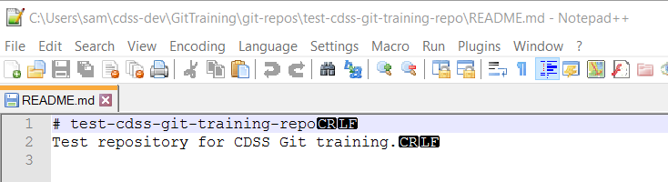

# Learn Git / Standard Repository Files #

This lesson explains standard repository files that should be present in most repositories.
These files help ensure that anyone that is working with the repository has a good experience and
technical issues are avoided.

The files that are discussed will be created in subsequent lessons.

**Estimated completion time:  30 minutes**

* [README.md](#readmemd) - landing page for GitHub repository web page
* [LICENSE](#license) - license for repository
* [.gitignore](#gitignore) - used to ignore files from being committed to the repository
* [.gitattributes](#gitattributes) - used to provide per-repository settings for all developers
* [.github Folder](#github-folder) - provide issues template, pull request template, and `README.md`

## README.md ##

The top-level `README.md` file provides information about the repository contents and purpose.
Creating a new repository on the GitHub site gives the option of adding a default `README.md` file,
or the file can be created with an editor.
The `README.md` file is the first documentation that will be shown for the repository on GitHub so
it should contain useful information about the repository and actionable instructions.
It is common to include the following sections:

* Contents
* Getting Started
* License
* Contributing
* Maintainer

Files with `.md` extension use [Markdown format](https://guides.github.com/features/mastering-markdown/),
which provides formatting information when viewed in tools such as the GitHub website.
Markdown files are also reasonably readable when viewed in a simple text editor.

Markdown files can contain links, including links to files in the repository (see URLs displayed in the browser for link
information that can be included in Markdown files).

Although Markdown files can be viewed in GitHub, it would be cumbersome to commit changes to the repository and
push to GitHub just to view.
Instead, it is helpful to use software that properly displays Markdown locally so that errors can be fixed before
committing to the repository.  For example, see [MarkdownPad](http://markdownpad.com/).

`README.md` files can also be created in any folder in the repository to provide useful information.

## LICENSE ##

A text `LICENSE` file should be included in the root folder to indicate terms of use for the repository contents.
A license file can be initialized when a new repository is created on GitHub or can be added later.

The OpenCDSS project is determining appropriate licenses for software and other content.

## .gitignore ##

A `.gitignore` file can be created in the repository root folder to indicate to Git software which files
should not be committed to the repository.
A default file can be initialized when creating a new repository on GitHub, based on the language for the project,
or the file can be created with a text editor.
It is often simplest to copy a `.gitignore` file from a similar repository.
It is typical that this file is customized for the programming language and development environment used for a project.
For example, Microsoft software temporary files, text editor backup files, log files, compiler output binary files,
and automated test output should be ignored.

**It is important to not commit files to the repository that should be ignored.**

Entries can be added to the `.gitignore` file for a new repository in anticipation of ignoring some files,
and the file can be updated as additional files are discovered that should be ignored.

Additional `.gitignore` files can be added in any folder if appropriate.

For example, the following `.gitignore` files are used for CDSS repositories:

* [Learn Git .gitignore file](https://github.com/OpenWaterFoundation/cdss-learn-git/blob/master/.gitignore) - this documentation
* [StateMod .gitignore file](https://github.com/OpenWaterFoundation/cdss-app-statemod-fortran/blob/master/.gitignore) - StateMod
source code repository (link may be broken because repository is not yet public):

See the following for more information:

* [.gitignore documentation](https://git-scm.com/docs/gitignore)
* [Useful .gitignore templates](https://github.com/github/gitignore)

## .gitattributes ##

A `.gitattributes` file can be created in the repository root folder,
and provides configuration settings for the repository.
This will override settings that a developer may have set during Git software configuration.

Properties control whether files are handled as text or binary,
and what line ending is used for text files.
Line endings are important because operating systems use different line endings (line feed on Linux and Mac,
and carriage return and line feed on Windows).
If developers work on different operating systems, there is potential that text files would flip-flop between
line endings for one developer and another.  Git provides features to avoid this.

For example, the following `.gitattributes` files are used for CDSS repositories:

* [Learn Git .gitattributes file](https://github.com/OpenWaterFoundation/cdss-learn-git/blob/master/.gitattributes) - this documentation
* [StateMod .gitattributes file](https://github.com/OpenWaterFoundation/cdss-app-statemod-fortran/blob/master/.gitattributes) - StateMod
source code repository (link may be broken because repository is not yet public):

See the following for more information:

* [.gitattributes documentation](https://git-scm.com/docs/gitattributes)
* [GitHub - Dealing with line endings](https://help.github.com/articles/dealing-with-line-endings/)

It may be helpful later to confirm the line endings that are actually used in files,
in particular if Git commands print warnings about line endings.
An editor such as Notepad++ can be used on Windows to view line endings, for example as shown in the following
(use the ***View / Shown Symbol / Show End of Line***):

## .github Folder #

A `.github` folder can be added at the top level of a repository as a location for additional repository control files,
as described below.  See also the [GitHub Issue and Pull Request templates article](https://github.com/blog/2111-issue-and-pull-request-templates).

* `README.md` - if present, the file will be displayed when visiting the GitHub repository website and will override
the `README.md` file created in the repository 
* `ISSUE_TEMPLATE.md` - if present, the file will be used as the template for new issues on the GitHub repository Issues tool
* `PULL_REQUESTI_TEMPLATE.md` - if present, the file will be used as the template for new pull requests on the GitHub repository Pull Requests tool
