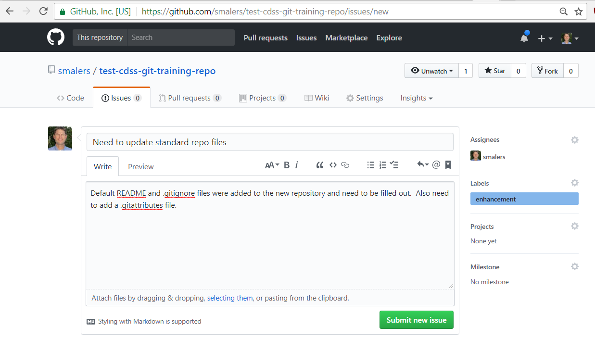
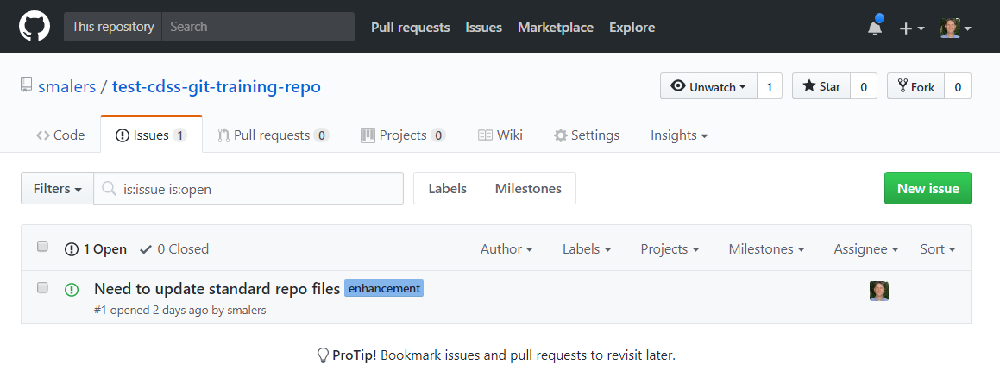
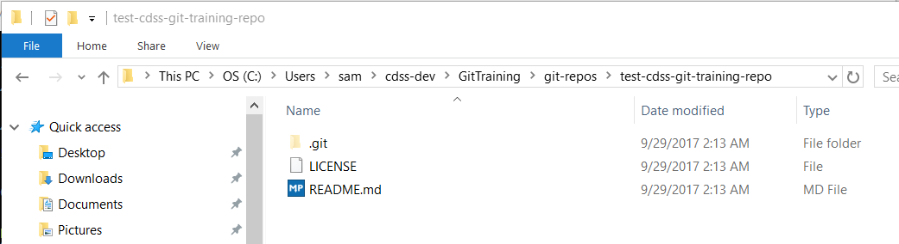
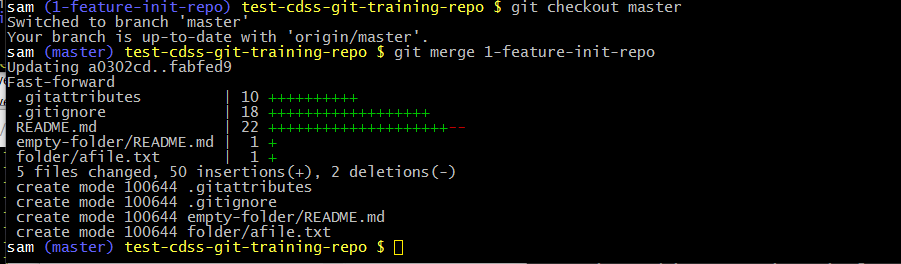
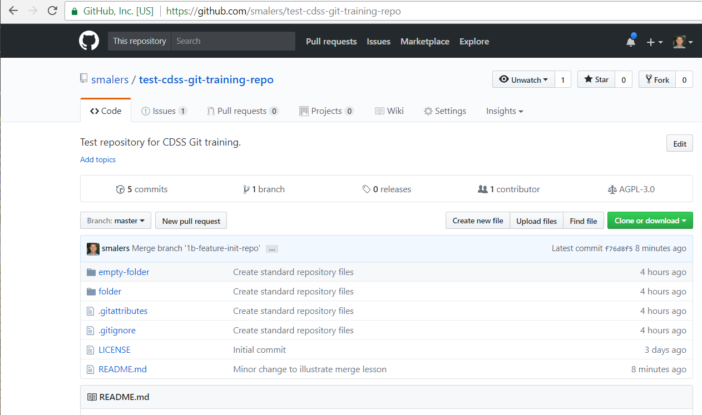
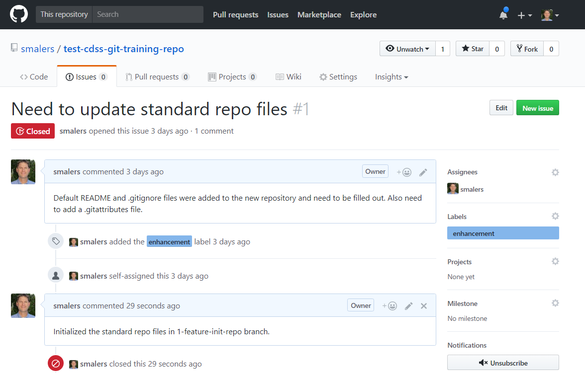
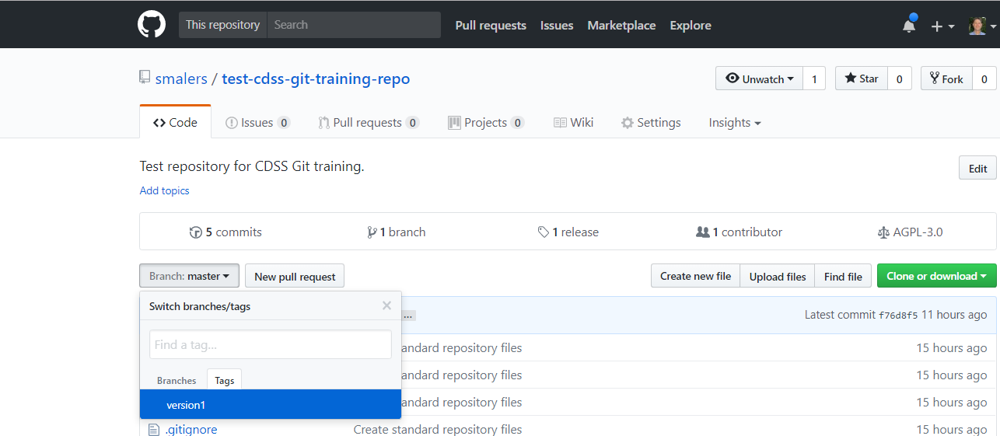

# Learn Git / Using Git #

This lesson explains how to use Git commands for a basic version control workflow.
Concepts and information from previous lessons are put into practice.
The lesson is somewhat verbose in order to explain each activity and Git command.
Future lessons omit the verbose background information.
It is expected that repeated use of Git commands will become second nature and the information can
be used as a reference, or search the internet for specific answers.

**Estimated completion time:  45-90 minutes**

**Note that `git` commands can be run from any folder in a repository's working files and will generate an error otherwise.
Git Bash is used for examples because of its utility.  The local computer user "sam" is used for examples, which
in this case is a different name than the GitHub "smalers" user but is the same person.**

The following sections are included in this lesson:

* [Create Repository and Clone Using `git clone`](#create-repository-and-clone-using-git-clone)
* [Create an Issue on GitHub Using GitHub Website](#create-an-issue-on-github-using-github-website)
* [Pull Current Version from GitHub using `git pull`](#pull-current-version-from-github-using-git-pull)
* [Create and Checkout a Branch Using `git branch` and `git checkout`](#create-and-checkout-a-branch-using-git-branch-and-git-checkout)
* [Add and Edit Files Using Text Editor](#add-and-edit-files-using-text-editor)
* [Check Repository Status Using `git status`](#check-repository-status-using-git-status)
* [Add Files to Staging Area Using `git add`](#add-files-to-staging-area-using-git-add)
* [Commit Files to Repository Using `git commit`](#commit-files-to-repository-using-git-commit)
* [View the Repository History Using `git log`](#view-the-repository-history-using-git-log)
* [Validate Changes Using Automated Tests](#validate-changes-using-automated-tests)
* [Merge Branch Using `git merge`](#merge-branch-using-git-merge)
* [Push Files to GitHub Using `git push`](#push-files-to-github-using-git-push)
* [Delete the Branch Using `git branch`](#delete-the-branch-using-git-branch)
* [Create a Tag Using `git tag`](#create-a-tag-using-git-tag)
* [Next Steps](#next-steps)

See also the [Pro Git Book](https://git-scm.com/book/en/v2).

----

## Create Repository and Clone Using `git clone` ##

**This step will be performed once whereas the remaining steps are performed in sequence every time
a new issue needs to be worked on.**

See the previous lesson for example of how to create a repository and clone to a local computer:
[New Repository](../05-lesson-new-repo/lesson-new-repo)

At any point the `git status` command can be used to display the status of the repository.
For example, the following output illustrates the status for a new repository using Git Bash:

```sh
sam git-repos $ cd test-cdss-git-training-repo/

sam (master) test-cdss-git-training-repo $ ls
LICENSE  README.md

sam (master) test-cdss-git-training-repo $ git status
On branch master
Your branch is up-to-date with 'origin/master'.
nothing to commit, working tree clean
```

Note that when using Git Bash the command shell prompt provides useful information, which for the above example includes
the current user (in this case `sam`), currently checked out branch (`master`),
and the current folder (`test-cdss-git-training-repo`).
The prompt will also show symbols to indicate the status of the repository (`*` meaning files have changed and `+` meaning
files have been added but not committed, as illustrated below).

When a repository is cloned, working files from a branch are automatically checked out and can be seen in the
repository folder.  The concept of working file is discussed more below.

## Create an Issue on GitHub Using GitHub Website ##

Files in a repository can be changed without extensive planning.
For example, a developer that has good understanding of software code can just decide to fix a bug or implement an enhancement
without telling anyone.
This may work well for a single-person team or a personal repository.
However, for multi-person teams and public repositories, it is helpful to connect the work done in a repository
to an issue that is identified and described.
Such issues can be prioritized, attached to specific people, and be paid for with funding from consulting projects.

The GitHub ***Issues*** tab for a repository provides a way to report bugs and request enhancements.
For example, use the ***New issue*** button to create a new issue, as shown in the following image.
The issue data on the right can be used to provide details that correspond to a branch name, such as whether an issue is
a bug or an enhancement (feature).
Comments can also be added to the issue, for example to indicate progress and coordinate between developers.



For this training, go ahead and create an issue similar to the following because it will be used in below.
Note that when the issue is submitted it will be given an issue number, in this case 1, as shown below:



## Pull Current Version from GitHub Using `git pull` ##

The default branch in the repository is named `master` and contains the current approved files that have previously been committed.
Only tested and validated changes should be committed to the master.
More information about repository workflow concepts is presented in later lessons.

During normal development on a team, changes will be committed to the `master` branch over time.
Before embarking on new changes, a first step is typically to synchronize the local `master` branch with the remote (GitHub)
`master` branch to ensure that work on a new issue is starting from the current published files.
This can be done with the `git pull` command, as follows:

```sh
sam (master) test-cdss-git-training-repo $ git pull
Already up-to-date.
```

The above indicates that the local files are already consistent with the remote files.

More advanced operations may be needed.  For example, `git pull` actually is equivalent to `git fetch` and `git merge`,
where the remote `origin/master` branch is being process with the local `master` branch. 
It may be appropriate to do these steps individually to allow for review and testing.
Other training lessons explain how to pull a remote branch.

There may also be a conflict if the work done by others and committed to the `master` branch overlaps files
that you have edited.  Later lessons focus on merge conflicts.

However, for simple workflows with a small number of repository maintainers,
assume that remote changes are OK and can be pulled into the `master` branch without issue.

## Create and Checkout a Branch Using `git branch` and `git checkout` ##

New work should be done in a branch, for a number of reasons:

* Using a branch ensures that a change to the project is encapsulated and has clear bounds.
This is helpful when reviewing change history and if the change needs to be rolled back.
* The branch can be discarded if it is decided that the work is not useful.
* If necessary, the work being done on a branch can be set aside until later, for example if a more urgent change needs to be done
on a hot fix branch.

A branch should be named according to a convention.
Although there is some precedent for using slashes, this will actually cause problems in some situations.
Therefore it is recommended that branch names use dashes (not slashes or spaces) and follow the pattern `issuenum-type-topic`, where

* `issuenum` is the issue number from the GitHub ***Issues*** tab for the repository.
* `type` is a category such as `bug` (for bug fix), `feature` (for enhancement), `test` (for a test), etc.
The GitHub ***Issues*** page provides a list of "labels" that can be used as an issue type.
* `topic` is a short phrase describing the issue, using dashes instead of spaces

The above example illustrated how to create an issue on the GitHub website.
Therefore, to work on the issue, create a new branch and check it out into the working files:

```sh
sam (master) test-cdss-git-training-repo $ git branch 1-feature-init-repo

sam (master) test-cdss-git-training-repo $ git checkout 1-feature-init-repo
Switched to branch '1-feature-init-repo'

sam (1-feature-init-repo) test-cdss-git-training-repo $ git status
On branch 1-feature-init-repo
nothing to commit, working tree clean

sam (1-feature-init-repo) test-cdss-git-training-repo $ git branch
* 1-feature-init-repo
  master
```

The above illustrates several commands.
The `git branch` command creates a new branch `1-feature-init-repo` but does not change to that branch.
A branch in the repository is a divergence from the current branch, in this case from the `master` branch.
The previously committed files in the `master` branch are the starting point for the new branch,
as well as any new or modified files in the working files.
It is possible to create multiple parallel branches, such as `master`, a `dev` branch for development, and issue/feature branches.
However, to keep things simple, OpenCDSS is initially using a `master` branch and issue/feature branches.

The `git checkout` command changes the current working files to the new branch (`1-feature-init-repo`).
Only one set of working files is used at a time and the `git checkout` command is used to switch the working files
between branches.
If by chance any files had been changed in working files but had not been committed to the `master`, they
would remain so that there is an opportunity to commit them to the new branch.
Git commands and protocols are available to help deal with retaining intermediate work (such as `git stash`),
but are not discussed here.

**Note that the command prompt for Git Bash changes to indicate that the current branch is now `1-feature-init-repo`.**

**Note also that the Git Bash window supports tab-completion.  For example, type `git checkout 1` and then
press the tab key and the `git` command will fill in the rest of the branch name.**
This can help be more efficient at using Git on the command line.

## Add and Edit Files Using Text Editor ##

The new (mostly empty) repository that was initialized on the GitHub website has files similar to the following:



Use a text editor to edit the `README.md` file so that it has contents similar to the following:

```txt
# test-cdss-git-training-repo #

This is a test repository used with the CDSS Git training.

## Contents ##

The repository contains a few folders and files created to demonstrate Git use.

## Maintainer ##

The repository is maintained by Steve Malers.

## Contributing ##

Although this is a public repository, it is just used for training so no contributions are expected.
If contributions were accepted, they would use the Issues or pull requests.

## License ##

[GPL 3.0](https://github.com/smalers/test-cdss-git-training-repo/blob/master/LICENSE)
```

Use a text editor to edit the `.gitignore` file so that it has contents similar to the following.
The list of files to be ignored can be expanded later if necessary.

```txt
# Files that should be automatically ignored (not saved) in the repository

# Ignore temporary files from editors

*.swp
*.swo

# Office temporary files

*.tmp

# Word
#~$*.doc*
# Excel
#~$*.xls*
# PowerPoint
#~$*.ppt*
~$*
```

Use a text editor to edit the `.gitattributes` file so that it has contents similar to the following.
The list of binary and text files can be expanded as needed.

```txt
# Settings for the repository

# Cause line endings in the repository to be linefeed (LF) and local files to be that of the operating system.

* text=auto

# Indicate binary files

*.png binary
*.jpg binary
```

Create an empty folder named `empty-folder`.

Create a folder named `folder` and create one or more text files in that folder.

**Note that at this point the working files have been changed but no files have been
added to the repository.  The new/modified files are just files on the file system.**

**Note also that the prompt for the Git Bash shell shows an asterisk, indicating the files have been changed:**

```sh
sam (1-feature-init-repo +) test-cdss-git-training-repo $
```

## Check Repository Status Using `git status` ##

A common task is to check the status of the repository and working files.
The `git status` command can be run in any folder in the repository working files
and will display the status of files, using relative paths from the current location.

```sh
sam (1-feature-init-repo *) test-cdss-git-training-repo $ git status
On branch 1-feature-init-repo
Changes not staged for commit:
  (use "git add <file>..." to update what will be committed)
  (use "git checkout -- <file>..." to discard changes in working directory)

        modified:   README.md

Untracked files:
  (use "git add <file>..." to include in what will be committed)

        .gitattributes
        .gitignore
        folder/

no changes added to commit (use "git add" and/or "git commit -a")
```

The above output indicates which files have been modified, and which are new (untracked).
If any files had been deleted, they would also be listed.
The `git status` command is also helpful to list files that should be ignored but have not yet been added to the `.gitignore` file.
Ignored files will not be listed by `git status` so if such files are listed, they need to be added to the `.gitignore` file.
It is wise to check the status between actions.
It is also wise to work on changes incrementally and commit incremental progress so that the list of files
that are modified for an issue is not overwhelming (committing is discussed below).

**Note that Git will not add an empty folder to the repository because the Git design is based on tracking file contents.**
Therefore, in order to keep an otherwise empty folder in a repository, something must be added to the folder.
Why would we want an empty folder?  One reason is as a location where dynamic content is created.
Rather than requiring other developers to create such folders so that processes work,
the folder is created ahead of time and is kept empty.
Another reason is that we have designed a folder structure for a project but have not yet added files
in all of the folders.
One solution to adding an empty folder to the repository is to add a `README.md` file with some simple
text - the file can be left as an explanation or can
be removed when it is no longer needed.  Or, add a `.gitignore` file with the following content:

```txt
# Ignore files in this folder, except for this .gitignore file itself
*
!.gitignore
```
For this lesson, create a `README.md` file in the `empty-folder` folder.
Running `git status` again will show the `empty-folder` (which is not actually totally empty):

```sh
sam (1-feature-init-repo *) test-cdss-git-training-repo $ git status
On branch 1-feature-init-repo
Changes not staged for commit:
  (use "git add <file>..." to update what will be committed)
  (use "git checkout -- <file>..." to discard changes in working directory)

        modified:   README.md

Untracked files:
  (use "git add <file>..." to include in what will be committed)

        .gitattributes
        .gitignore
        empty-folder/
        folder/

no changes added to commit (use "git add" and/or "git commit -a")
```

**Note that `git status` does not list the files in new folders (it only lists the new folder).**
The files will be shown after the `git add` command is used, as discussed in the next section.

## Add Files to Staging Area Using `git add` ##

The previous file modifications resulted in changes to the working files.
However, these files do not automatically get added to the Git repository.
Git requires that files must be specifically indicated for commits, which
allows incremental work to be purposefully committed to the repository.
An analogy is moving files to a virtual folder before writing them to a DVD
(the DVD burning software manages the list of files to write to the DVD).

Git uses an intermediate area called the "index" or "staging area" for files that
exist in the working files and will also be committed to the repository.
The following image illustrates the different Git file areas (see original in
["Getting Started - Git Basics"](https://git-scm.com/book/en/v2/Getting-Started-Git-Basics)).
There are actually 3 locations on the local computer where files can exist
(although it is generally not worth trying to figure out the internals of the staging area and `.git` folder).


Use the `git add` command to add (stage) files for the commit step, in this case using the example files in this lesson.
The following assume that the current folder is the root folder in the working files (the repository folder).
The following `git add` command adds a single file and `git status` shows that it has now
been staged because the `README.md` file is listed under `Changes to be committed`:

```sh
sam (1-feature-init-repo *) test-cdss-git-training-repo $ git add README.md
sam (1-feature-init-repo +) test-cdss-git-training-repo $ git status
On branch 1-feature-init-repo
Changes to be committed:
  (use "git reset HEAD <file>..." to unstage)

        modified:   README.md

Untracked files:
  (use "git add <file>..." to include in what will be committed)

        .gitattributes
        .gitignore
        empty-folder/
        folder/

```

**Note that the Git Bash prompt now shows a +, indicating that files have been added to the staging area.**

The following `git add` command adds multiple files using a `*` wildcard,
in this case adding the two new folders:

```sh
sam (1-feature-init-repo +) test-cdss-git-training-repo $ git add *folder
warning: LF will be replaced by CRLF in empty-folder/README.md.
The file will have its original line endings in your working directory.
warning: LF will be replaced by CRLF in folder/afile.txt.
The file will have its original line endings in your working directory.

sam (1-feature-init-repo +) test-cdss-git-training-repo $ git status
On branch 1-feature-init-repo
Changes to be committed:
  (use "git reset HEAD <file>..." to unstage)

        modified:   README.md
        new file:   empty-folder/README.md
        new file:   folder/afile.txt

Untracked files:
  (use "git add <file>..." to include in what will be committed)

        .gitattributes
        .gitignore
```

Note that the `Changes to be committed` section does not say anything about the new folders
but instead says `new file:` for each new file in the new folders.

The messages about `LF will be replaced by CRLF` is due to using the `vim` editor within Git Bash,
which created the files using Linux-style line endings (LF).
Git for Windows will actually check out files using Windows-style CRLF line endings, hence the warning.
The `.gitattributes` settings will ensure that files in the repository use LF in any case.
Such messages will likely not be shown if a Windows editor is used to edit files.
In summary, these warnings can generally be ignored and will generally be omitted from this training documentation.

Finally, `git add -A` is useful for adding all files that have been modified.
This is particularly useful because in addition to adding files that are new or have been modified,
the `git rm` command can be used to delete files from the repository,
and must be used if the file was removed from the file system.
The `git add -A` command can be used instead of specific `git add` and `git rm` commands.

```sh
sam (1-feature-init-repo +) test-cdss-git-training-repo $ git add -A
sam (1-feature-init-repo +) test-cdss-git-training-repo $ git status
On branch 1-feature-init-repo
Changes to be committed:
  (use "git reset HEAD <file>..." to unstage)

        new file:   .gitattributes
        new file:   .gitignore
        modified:   README.md
        new file:   empty-folder/README.md
        new file:   folder/afile.txt
```

The above shows that all files are now ready to be committed.

If `git add -A` adds too many files (such as files that need to be in `.gitignore`),
remove the files from the staging area using `git reset HEAD -- path/to/file`,
as per the [Stack Overflow article](https://stackoverflow.com/questions/19730565/how-to-remove-files-from-git-staging-area).

## Commit Files to Repository Using `git commit` ##

At this point files have been modified in the working files and have been staged for commit.
The `git commit` command is used to commit the changes to the repository on the currently checked-out branch.
The command is generally run either by specifying the commit message on the command line,
or by specifying the commit message in an editor (`git config --list` will display the `core.editor` property).

### Commit using Command Line Commit Message ###

```sh
sam (1-feature-init-repo +) test-cdss-git-training-repo $ git commit -m 'Create standard repository files'
[1-feature-init-repo 50dadc6] Create standard repository files
 5 files changed, 50 insertions(+), 2 deletions(-)
 create mode 100644 .gitattributes
 The following illustrates how to commit files using a command-line commit message:
 create mode 100644 .gitignore
 rewrite README.md (100%)
 create mode 100644 empty-folder/README.md
 create mode 100644 folder/afile.txt

 sam (1-feature-init-repo) test-cdss-git-training-repo $ git status
 On branch 1-feature-init-repo
 nothing to commit, working tree clean
```

Note that the output from the `git commit` command provides feedback on whether a new file was created in the repository (`create`)
or was updated (`rewrite`).
The mode numbers indicate the type of file - Git will try to retain information about whether a file is a normal file
(mode=100644), executable (mode=100755), etc., so that when someone else clones the repository or checks out a branch
the file mode will match the original.
Note that the `git status` output shows that the working files and repository branch are in agreement and the
Git Bash prompt is normal again (no `*` or `+` shown).

### Commit using Text Editor Commit Message ###

The other typical way to commit changes is to interactively edit the commit message.
This is preferred in many cases because a best practice is to enter a summary message on the first line,
then a blank line, then more details, in particular when doing a merge commit (discussed below).
To simulate this approach and confirm that an editor is assigned, edit and commit the `README.md` file as shown below.

First edit the README.md file using the text editor of choice.  Then run the commands shown below:

```sh

sam (1-feature-init-repo *) test-cdss-git-training-repo $ git add README.md
sam (1-feature-init-repo +) test-cdss-git-training-repo $ git commit

```

The `git commit` command will start an editor in a temporary file and will
automatically generate a useful default message and instructions.
The `#-comments` will not be part of the saved commit message.
Edit the commit message with comments similar to the following and save the file.

```txt
Updated README.md file to include more information about the repository.

This is an example of a multi-line commit message.
# Please enter the commit message for your changes. Lines starting
# with '#' will be ignored, and an empty message aborts the commit.
# On branch 1-feature-init-repo
# Changes to be committed:
#       modified:   README.md
#
```

The first line will be displayed by Git commands that summarizes change history and the full commit message is
displayed where more verbose history is requested.
Save the file and the following will be displayed:

```sh
[1-feature-init-repo fabfed9] Updated README.md file to include more information about the repository.
 1 file changed, 1 insertion(+), 1 deletion(-)
 sam (1-feature-init-repo) test-cdss-git-training-repo $ git status
 On branch 1-feature-init-repo
 nothing to commit, working tree clean
```

## View the Repository History Using `git log` ##

At this point, if following the training instructions, there should be 3 commits in the repository for the branch:
the original commit from GitHub, and two commits for files that have been added and modified.
The `git log` command shows the history of commands:

```sh
sam (1-feature-init-repo) test-cdss-git-training-repo $ git log
commit fabfed9377ec2b3d271e8829c5abd18ae5928105
Author: Steve Malers <steve.malers@openwaterfoundation.org>
Date:   Sun Oct 1 11:21:11 2017 -0600

    Updated README.md file to include more information about the repository.

    This is an example of a multi-line commit message.

commit 50dadc6c618aee13495f0fd2acd5ee58d544cdf7
Author: Steve Malers <steve.malers@openwaterfoundation.org>
Date:   Sun Oct 1 11:05:33 2017 -0600

    Create standard repository files

commit a0302cda79d7f085c790514f4212f5c9ee5a2b0e
Author: Steve Malers <steve.malers@openwaterfoundation.org>
Date:   Fri Sep 29 01:18:54 2017 -0600

     Initial commit
```

The commit messages show the SHA-1 hash strings that provide unique identifiers for a commit.
These hashes are useful for tracking the history but the date/time and commit messages are often more useful
for basic use and illustrate why it is important to provide useful commit messages.
The following example shows how to visually graph the history (it will be more interesting as more changes are committed):

```sh
sam (1-feature-init-repo) test-cdss-git-training-repo $ git log --oneline --graph --decorate --all
* fabfed9 (HEAD -> 1-feature-init-repo) Updated README.md file to include more information about the repository.
* 50dadc6 Create standard repository files
* a0302cd (origin/master, origin/HEAD, master) Initial commit
```

It is also useful to know what GitHub issue is being worked on.
This connection is discussed in the next section.

Finally, graphical interfaces such as Git GUI are available that can display the repository log (history).
These tools are not discussed in this basic training.

## Validate Changes Using Automated Tests ##

At this point the local branch has been updated to include the new changes,
and the repository is in agreement with the working files.
The next steps are to merge the branch into the master branch as an official change and then push the local changes
to the remote repository so that other people can synchronize those changes into their work.

However, we want to make sure that the work that has been done is correct because we don't want to share
files that have errors.
Therefore, we need to do final validation of the files before merging them.
Actually, testing should have occurred on working files in previous steps before committing to the local branch,
and final validation is just that... a final check.

Validation is not something that Git does.
Instead, automated software testing or other checks would occur consistent with the development tools.
More information about software testing is discussed in the development documentation for each software program.

If it is necessary to share the changes with a collaborator before merging,
then it is possible to push the branch to GitHub before merging.
Then the collaborator can pull the branch to their local computer and examine the files.
Such collaboration may or may not be needed, depending on the size of the team and the need for peer review.

## Merge Branch using `git merge` ##

Assuming that the files that have been committed to the local issue branch have passed tests,
they can be merged into the `master` branch using the `git merge` command.
A merge can involve small units of work such as a single commit,
or a merge may involve multiple commits that have been made to the local issue branch.
A large merge typically involves a more substantial change, such as a major new software feature.

Git software is fairly sophisticated in its ability to merge content from multiple files and detect conflicts.
Merge conflicts are discussed in a later lesson.
A merge conflict occurs when more than one developer has changed the same lines in a file and the
`git merge` command does not know how to automatically resolve the merge.
Alternatively, in many cases, coordination on a team will ensure that only one person is working in an area of
the code at the same time and merge conflicts can be avoided.
The initial `git pull` (or `git fetch` followed by `git merge`) serves to align the GitHub `master` branch
with the local `master` branch so that any increment of work is manageable and minimizes merge conflicts.

Git provides several features to control merges and the protocols of a specific project may define the approach.
The protocol for OpenCDSS is to follow best practices but there are often multiple approaches.
The following sections describe options for merging, although
there is much more information online.

**The preferred option for OpenCDSS is the `git merge --no-ff` option discussed below.
Other options may be considered in the future as developers become more skilled with Git.**

### Merge Using `git merge` - Default is to Fast Forward ###

By default, the `git merge` command will do a "fast forward" merge.
This means that all the changes on the local issue branch will be replayed onto the `master` branch and the commit history
will include every incremental commit that occurred.
The term "fast forward" is used because the head of the `master` branch (the most recent commit) is moved to the same commit as the
most recent commit on the issue branch.
The downside of this approach is that the history becomes a long sequence of (at times) minor commit messages.
And, by default, there is no indication of the branch merge.
Therefore, multiple branch merges just look like a lot of commits on the `master`.
One philosophy is that all commits should be present in the history and another philosophy is that the history should be compact.

Let's illustrate this merge approach with the training repository.
The previous steps have committed all changes to the issue branch and there should be two commits.
To merge the branch it is necessary to first checkout the `master` branch using `git checkout master`
and then merge the requested issue branch into the master using `git merge 1-feature-init-repo`,
as follows.  **An image is used to illustrate the colors output by Git Bash.**



Note that `git merge` indicates in output that a `Fast-forward` merge is occurring.
The graph indicates the number of additions and deletions to each file.

The following `git log` output illustrates the history for the `master` branch, which now includes the commits
that were made to the issue branch.
Note that the SHA-1 hash strings for the commits match those in the issue branch.

```sh
sam (master) test-cdss-git-training-repo $ git log
commit fabfed9377ec2b3d271e8829c5abd18ae5928105
Author: Steve Malers <steve.malers@openwaterfoundation.org>
Date:   Sun Oct 1 11:21:11 2017 -0600

    Updated README.md file to include more information about the repository.

    This is an example of a multi-line commit message.

commit 50dadc6c618aee13495f0fd2acd5ee58d544cdf7
Author: Steve Malers <steve.malers@openwaterfoundation.org>
Date:   Sun Oct 1 11:05:33 2017 -0600

    Create standard repository files

commit a0302cda79d7f085c790514f4212f5c9ee5a2b0e
Author: Steve Malers <steve.malers@openwaterfoundation.org>
Date:   Fri Sep 29 01:18:54 2017 -0600

    Initial commit

```

The downside of the above output is that it is difficult to see when an issue branch was merged
since only the specific commit messages are indicated.
An alternative approach is discussed in the next section.

### Merge Using `git merge --no-ff` - Do not Fast Forward ###

In order to illustrate another approach, we must first create another branch to demonstrate.
Therefore, execute commands as follows to create a new `1b-feature-init-repo` branch:

```sh
sam (master) test-cdss-git-training-repo $ git branch 1b-feature-init-repo
sam (master) test-cdss-git-training-repo $ git checkout 1b-feature-init-repo

... then edit the README.md file with a text editor...

sam (1b-feature-init-repo *) test-cdss-git-training-repo $ git add README.md

sam (1b-feature-init-repo +) test-cdss-git-training-repo $ git commit -m 'Minor change to illustrate merge lesson'
[1b-feature-init-repo c4a4eb5] Minor change to illustrate merge lesson
 1 file changed, 2 insertions(+), 1 deletion(-)

sam (1b-feature-init-repo) test-cdss-git-training-repo $ git checkout master
Switched to branch 'master'
Your branch is ahead of 'origin/master' by 2 commits.
   (use "git push" to publish your local commits)

sam (master) test-cdss-git-training-repo $ git merge --no-ff 1b-feature-init-repo
Merge made by the 'recursive' strategy.
 README.md | 3 ++-
 1 file changed, 2 insertions(+), 1 deletion(-)


sam (master) test-cdss-git-training-repo $ git log --oneline --graph --decorate --all
*   f76d8f5 (HEAD -> master) Merge branch '1b-feature-init-repo'
|\
| * c4a4eb5 (1b-feature-init-repo) Minor change to illustrate merge lesson
|/
* fabfed9 (1-feature-init-repo) Updated README.md file to include more information about the repository.
* 50dadc6 Create standard repository files
* a0302cd (origin/master, origin/HEAD) Initial commit

```

**Note that the `git merge --no-ff` command prompted for a commit message (whereas `git merge` did not),
and `git merge --no-ff` will automatically insert a draft comment indicating the branch being merged.**
The git log therefore contains all of the normal "fast forward" commits and additionally a commit for the merge,
which is helpful to understand when branches were merged.

The following is the `git log` output.  Note the extra `Merge branch` commit in the `git log` output,
which provides a clear indication of when the branch was merged.

```sh
sam (master) test-cdss-git-training-repo $ git log
commit f76d8f5d24db3cd9353d7874d093f286c80dc4f0
Merge: fabfed9 c4a4eb5
Author: Steve Malers <steve.malers@openwaterfoundation.org>
Date:   Sun Oct 1 15:10:52 2017 -0600

    Merge branch '1b-feature-init-repo'

    Example of using git merge --no-ff

commit c4a4eb523f281d079fefa6caf41406fc4d33233d
Author: Steve Malers <steve.malers@openwaterfoundation.org>
Date:   Sun Oct 1 15:10:14 2017 -0600

    Minor change to illustrate merge lesson

commit fabfed9377ec2b3d271e8829c5abd18ae5928105
Author: Steve Malers <steve.malers@openwaterfoundation.org>
Date:   Sun Oct 1 11:21:11 2017 -0600

    Updated README.md file to include more information about the repository.

    This is an example of a multi-line commit message.

commit 50dadc6c618aee13495f0fd2acd5ee58d544cdf7
Author: Steve Malers <steve.malers@openwaterfoundation.org>
Date:   Sun Oct 1 11:05:33 2017 -0600

     Create standard repository files

commit a0302cda79d7f085c790514f4212f5c9ee5a2b0e
Author: Steve Malers <steve.malers@openwaterfoundation.org>
Date:   Fri Sep 29 01:18:54 2017 -0600

    Initial commit
```

### Merge Using `git rebase` - Compress the History ###

Git rebasing basically replaces changes onto the receiving branch so that all the changes are combined.
This approach is not recommended for OpenCDSS until developers become skilled at basic Git usage.

See the [Git Pro Book chapter on Git Branching - Rebasing](https://git-scm.com/book/en/v2/Git-Branching-Rebasing)
for more information.

## Push Files to GitHub Using `git push` ##

At this point the original issue is hopefully resolved and has been sufficiently tested so that it can be publicly released.
Running `git status` again shows the following:

```sh
sam (master) test-cdss-git-training-repo $ git status
On branch master
Your branch is ahead of 'origin/master' by 4 commits.
  (use "git push" to publish your local commits)
  nothing to commit, working tree clean

```

The above indicates that the local repository is 4 commits ahead of the remote `master` branch on GitHub.
Therefore, to push the changes to GitHub, run as follows:

```sh
sam (master) test-cdss-git-training-repo $ git push
Counting objects: 16, done.
Delta compression using up to 8 threads.
Compressing objects: 100% (12/12), done.
Writing objects: 100% (16/16), 1.89 KiB | 0 bytes/s, done.
Total 16 (delta 5), reused 0 (delta 0)
remote: Resolving deltas: 100% (5/5), done.
To https://github.com/smalers/test-cdss-git-training-repo.git
   a0302cd..f76d8f5  master -> master
```

Because the files have been pushed to GitHub, it is now possible to view the files on GitHub,
as shown in the following image:



Because the issue is resolved, use the GitHub ***Issues*** tab for the repository to add a comment and mark the issue as resolved,
similar to the following.
It may be helpful to confirm with the original issue reporter that the issue is resolved before closing.
It is also desirable to implement an automate test to confirm a bug fix or new feature.



## Delete the Branch Using `git branch` ##

After the above actions, the local `master` branch is consistent with the remote GitHub `master` branch and there
are two local branches that were used for incremental work.  These branches can be listed as shown below:

```sh
sam (master) test-cdss-git-training-repo $ git branch
  1-feature-init-repo
  1b-feature-init-repo
* master
```

The asterisk `*` indicates that `master` is the current branch, which is consistent with the Git Bash prompt.

Because the issue branches are no longer needed, they can be deleted.
However, before deleting, try the following commands, which indicate whether a local branch has or has not
been merged with the master (useful if a branch exists for some long-running enhancement or has been set aside for some reason):

```sh
sam (master) test-cdss-git-training-repo $ git branch --merged master
  1-feature-init-repo
  1b-feature-init-repo
* master

sam (master) test-cdss-git-training-repo $ git branch --no-merged master

```

We know that both feature branches were merged so it is safe to delete them.
Or, if it were appropriate to do a backup of the working files for the branch, a branch could be checked out
with `git checkout 1-feature-init-repo`, do the backup, and then run `git checkout master`.

To delete the branches that are no longer needed:

```sh
sam (master) test-cdss-git-training-repo $ git branch -d 1-feature-init-repo
Deleted branch 1-feature-init-repo (was fabfed9).

sam (master) test-cdss-git-training-repo $ git branch -d 1b-feature-init-repo
Deleted branch 1b-feature-init-repo (was c4a4eb5).

sam (master) test-cdss-git-training-repo $ git log --oneline --graph --decorate --all
*   f76d8f5 (HEAD -> master, origin/master, origin/HEAD) Merge branch '1b-feature-init-repo'
|\
| * c4a4eb5 Minor change to illustrate merge lesson
|/
* fabfed9 Updated README.md file to include more information about the repository.
* 50dadc6 Create standard repository files
* a0302cd Initial commit

```

Note that in the above the branch is still indicated in the history (even if deleted) because Git
recognizes that there was a divergence and then a merge, based on the number of parent and child commits.
However, the first "fast forward" merge simply played the changes onto the master and does not show the branch.

## Create a Tag Using `git tag` ##

Git branches can be used for long-running version histories such as `master`
and short histories such as a bug fix or feature branch.
In both cases, a branch typically represents work that occurs over a timespan.
A branch can continue to move forward with additional commits.

A "tag", on the other hand, represents the status and contents of the repository at a single point in time.
Tags are most often used to indicate milestones or release versions.
Tags are convenient because it is possible to checkout the repository working files corresponding to a tag,
for example to build a version of software or to examine a document at a point in time.
Tags have similarity to other commits.
For more information, see: [Git Pro Book - Tagging](https://git-scm.com/book/en/v2/Git-Basics-Tagging).

Tags can be created as lightweight or annotated.  It is best to use annotated tags, as shown in the following example:

```sh
sam (master) test-cdss-git-training-repo $ git tag -a version1 -m 'Version 1 of product'

sam (master) test-cdss-git-training-repo $ git tag
version1

sam (master) test-cdss-git-training-repo $ git push origin --tags
Counting objects: 1, done.
Writing objects: 100% (1/1), 182 bytes | 0 bytes/s, done.
Total 1 (delta 0), reused 0 (delta 0)
To https://github.com/smalers/test-cdss-git-training-repo.git
 * [new tag]         version1 -> version1

```

The `git tag` command with annotation and commit message creates the tag for the current commit.

The `git tag` command without other parameters lists tags.

The `git push` command pushes the tags to the GitHub repository.

The tag is then listed on GitHub as shown in the following image.



## Next Steps ##

The next steps are to learn more about GitHub features, to apply what you have learned to code and dataset repositories,
and to increase your knowledge with more advanced topics such as dealing with merge conflicts.
From this point forward the lessons can be taken non-sequentially.
