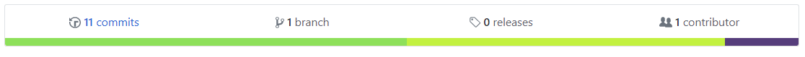
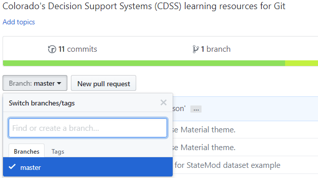
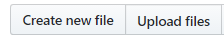
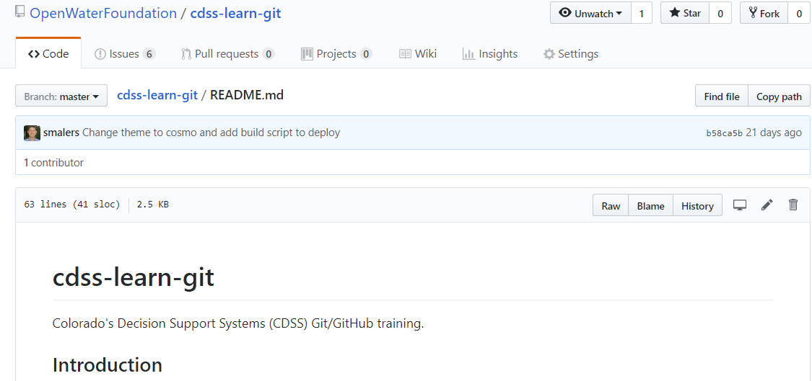

# Learn Git / GitHub Tools #

This lesson describes tools that are available on the GitHub website.
Select a GitHub repository to study and follow along with the lesson explanations.

**Estimated completion time:  15-30 minutes**

* [GitHub General Features](#github-general-features) - GitHub website basics
* [Code](#code) - tools to interact with source files
* [Insights](#insights) - metrics about repository activities
* [Issues](#issues) - tools for reporting and managing issues
* [Pull requests](#pull-requests) - tools for managing pull requests (submissions from collaborators)
* [Releases](#releases) - archive for product milestones
* [Settings](#settings) - change repository information
* [Wiki](#wiki) - online wiki for the repository

-------------

## GitHub General Features ##

The GitHub website provides features to search for and interact with Git repositories.
Think of GitHub as a cloud-hosted file-sharing website that promotes collaboration.

Once logged into GitHub, the website will recognize the organizations that you belong to, if any, such as employers that
have organization GitHub accounts.
GitHub will also recognize personal account repositories.

Use the settings menu in the upper right to access ***Your profile*** to go to your personal account home page,
which provides information about your activity on GitHub, such as contributions (commits) to repositories
and issues reported.
On that page will be a list of ***Organizations***, which can be used to jump to repositories for an organization.
In most cases, you will interact with a specific repository, via that repository's web page, which is further discussed in the following sections.

## Code ##

The `<> Code` tab on the repository page provides features related to viewing and performing code actions.

### README.md View ###

By default, if the current repository URL contains a `README.md` file, then the contents of that file will be displayed in formatted view.
This provides a convenient way to navigate and view repository contents without having to download files to a local computer.
The use of `README.md` files for general documentation tends to increase once the utility of this approach is realized.

### Statistics ###

Statistics for the website are displayed in a colored bar across the top of the repository page, as shown in the following image.

The number of commits, etc. are listed.  The colored horizontal bar indicates the distribution of language for the files in the repository,
presumably determined from file extensions or by examining file content.
Click on the bar to see more information about the languages used.

### Branch/Tag Selection ###

GitHub will by default display the latest repository contents for the `master` branch.
However, it is possible to select a different branch or tag by using the choices on the website, as shown in the following image.
For example, two web browser windows can be used to view two different versions of a repository.

### Adding Files ###

The GitHub repository page will allow interaction with the repository, including adding files. 
This may be convenient for some repositories but for complex projects it is best to use the workflow that has been decided on for the project.
Adding files directly via the GitHub website results in a commit on the selected branch, moving the commit history forward.

Note that adding files (or editing files) via the website requires a pull to synchronize those files with files on the local computer.

### Clone or Download ###

The ***Clone or download*** button can be used to perform the following actions:

* Download a zip file of the entire repository's contents, which can be useful for repositories that contain content that
can be directly used by consumers of the files without requiring installation and configuration of Git software.
If it is desired to download one or a few files, the source files can be viewed and downloaded as needed, discussed below.
* Clone the repository by copying the repository URL to a `git clone` command line command - collaborators with write permission will use this approach.
* ***Open in Desktop*** is used if GitHub Desktop has been installed (for CDSS Git for Windows is recommended instead).

### Source File Tools ###

When a source file is selected, additional tools are available.

Basic information about the file is displayed including size, recent commit history information.
The following tools are provided:

* ***Normal View (default)*** - GitHub will attempt to display the file in an appropriate viewer,
if it recognizes the content type and provides support for the format.
For example, Markdown files are shown in formatted form rather than raw text form.
Source code for programming languages is formatted to show line numbers.

* ***Raw*** - used to open in a browser view showing the raw text.  Although it is possible to copy and paste from the default view,
the raw view may be more convenient when copy and pasting source content.
The browser's CTRL-S (save) feature can be used to save the file to the computer.

* ***Blame*** - use to display who edited each line of the file.

* ***History*** - show the output similar to the `git log` command, indicating the modification history of the file.

## Insights ##

Insights provides metrics about the repository, in particular the modification activity.
Additional information about Insights and their use for CDSS will be added later.

## Issues ##

The ***Issues*** tab displays an interface that lists open issues.
A number of tools are provided to filter and sort issues.
Developers will add new issues for bugs and enhancements,
specify issue labels for type/priority/size, add comments as issues are discussed and work is completed,
and close the issue when resolved.
The ***Issues*** feature is used for CDSS repositories to report and track bugs, make enhancement requests, and
ask questions.

The issue number is automatically generated when adding a new issue
and should be used in branch names during development, which allows cross-referencing
repository commits and merges with issues.

See also:

* [GitHub Guides - Mastering Issues](https://guides.github.com/features/issues/)

## Pull requests ##

Pull requests are discussed in the [Pull Requests](../08c-lesson-pull-requests/lesson-pull-requests) section.

See also:

* [About pull requests](https://help.github.com/articles/about-pull-requests/)

## Releases ##

The ***Releases*** feature (above the code list) provides a way to publish archived product releases.
See [Creating Releases](https://help.github.com/articles/creating-releases/).

* Any tag on the repository will automatically be listed as a release, and GitHub will automatically
provide a link to download the code as a `zip` or `tar.gz` file.
* Additional binary files can be saved with the release, such as an installer.

This provides a convenient way to archive installers.
However, it may not be full-featured enough to use for the full software download page.

## Settings ##

Settings can be changed by repository administrators and those with write permissions, depending on the setting being changed.
For example, a repository can be renamed or moved to ownership of another organization.

## Wiki ##

Information about Wikis and their use for CDSS will be added later.

See also:

* [GitHub Wiki Help](https://help.github.com/categories/wiki/)
