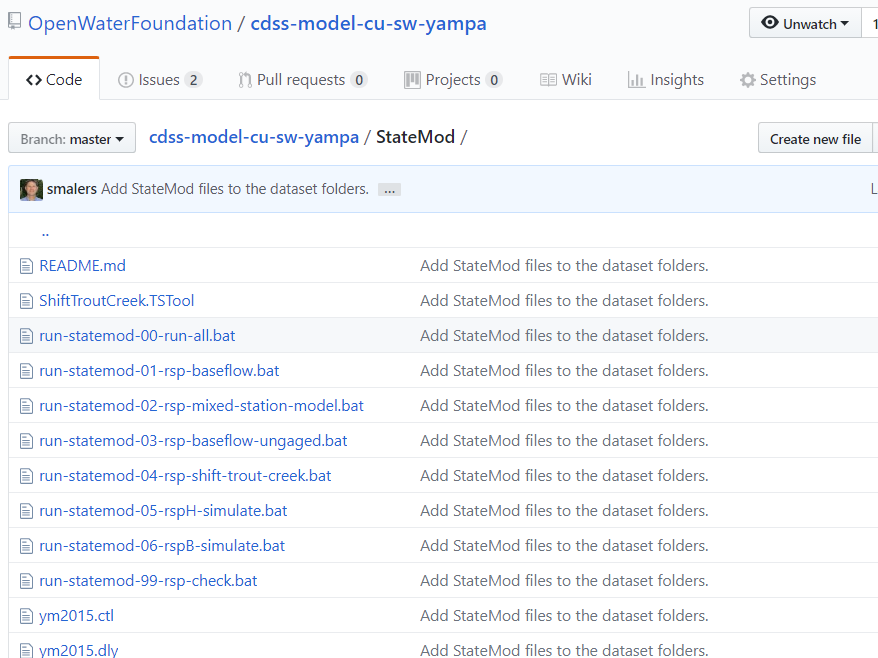

# Learn Git / StateMod Dataset Example #

This lesson discusses options for maintaining StateMod (and other CDSS model) datasets in Git repositories.
Complete the lesson by reading the information on this page and following links to other information.
Then apply what you have learned in your work.

**Estimated completion time:  15-30 minutes**

CDSS datasets have traditionally not been maintained in a version control system.
Instead, dated folders or other methods have been used to track versions.
This can be problematic due to multiple versions of files existing on different computers
being modified by different modelers, sometimes at the same time.

Tools that allow file comparison, such as discussed in the [Difference Tools](../07c-lesson-diff-tools/lesson-diff-tools) section
can help, but a version control system is designed to help with such issues.

The Open Water Foundation is working with StateCU/StateMod modelers on an experiment to evaluate whether Git/GitHub
version control can effectively be used to track versions of CDSS model dataset files.
This experiment involves training modelers to use Git/GitHub software and protocols as well as evaluating
the benefits of version control.
The initial experiment created separate Git repositories for StateCU and StateMod Yampa basin datasets.
This was generally successful; however, after an initial evaluation, it was decided to maintain the
datasets in a single repository because work on the models often occurs at the same time and files are shared
between datasets.
Consequently, a joined repository dataset was created:

The remainder of this page discusses technical considerations with using Git for model datasets.

* [StateMod Dataset Version Control Considerations](#stateMod-dataset-version-control-considerations)
* [Git Workflow for StateMod Dataset](#git-workflow-for-statemod-dataset)
* [cdss-model-cu-sw-yampa StateCU and StateMod dataset repository](https://github.com/OpenWaterFoundation/cdss-model-cu-sw-yampa) - used in discussion

--------------

## StateMod Dataset Version Control Considerations ##

Using Git to maintain StateMod and other datasets in version control requires some discipline in order to utilize best practices.
Otherwise, the repository may simply become a catch-all for miscellaneous files.
The following are considerations for using Git version control for datasets:

1. **Use standard repository folders** - The repository folders should be consistent with the standard dataset and process conventions that
are used in CDSS modeling.  Because CDSS model dataset folders have evolved into a standard convention,
it should be possible to implement the same folder structure across all basin datasets.
However, because datasets are updated at different times by different consultants, there is some variation.
It is recommended that the Yampa Git experiment should be used to confirm the standard folder structure.
If the Git approach is accepted, then other basin datasets can be updated as they are reviewed.
See the [GitHub repository source files illustrating folder structure](https://github.com/OpenWaterFoundation/cdss-model-cu-sw-yampa).
2. **Use `README.md` files to explain repository contents** - `README.md` files that use Markdown syntax are commonly used
in Git/GitHub repositories for software projects.  The markdown syntax is simple to edit and is formatted nicely in a web browser
when viewing repository files in the GitHub website.
These files therefore self-document the dataset and can be very helpful to describe source of data, process steps, etc.
Because Markdown is used, the files can contain links to online resources.
The following are examples:
	* See the [main `README.md` file in the Yampa dataset repository](https://github.com/OpenWaterFoundation/cdss-model-cu-sw-yampa/blob/master/README.md)
	* See the [`README.md` file in the `Diversions` folder in the StateMod dataset](https://github.com/OpenWaterFoundation/cdss-model-cu-sw-yampa/blob/master/Diversions/README.md)
3. **Document data processing steps in `README.md` files** - It has been traditional to use Word/PDF dataset documentation to describe
the dataset contents and processing steps.
However, it can be cumbersome to understand find the appropriate documentation and keep the documentation up to date.
Therefore, `README.md` files can be used in each folder to describe the name and execution
order of command files, and top-level `README.md` file can be used to describe overall order to process folders.
This allows developers and modelers to refer to the `README.md` files that are immediately accessible rather than
having to consult a PDF document.  `README.md` files can also indicate the source of third-party data.
**The prototype `README.md` files need to be updated to document input and processing order, for example
by listing command files in the `README.md` in the order that they should be run.**
4. **Document dependencies** - New features are being evaluated in CDSS software to check file dependencies,
in order to help ensure that a multi-step process is always fully completed.
For example, special comments could be added to command files and model control files to indicate which input files
are used.  If the timestamp on an input files is newer, then the modeler could be warned that some steps need to be rerun.
Modelers should consult with OWF to collaborate on new features.
5. **Only include input files in repositories** - Consistent with version control best practices,
the repository should only contain source input files.
Any files that are dynamically created, such as StateCU and StateMod model files created by TSTool and StateDMI,
should **not** be saved in the repository.
Otherwise, files that are regenerated by a second modeler (and have file headers with different information)
will be saved in the repository... and the next modeler will save another iteration.
The [Yampa dataset .gitignore file](https://github.com/OpenWaterFoundation/cdss-model-cu-sw-yampa/blob/master/.gitignore)
file contains a list of all file extensions and specific files to ignore.
Output created by running data processing software can be packaged into distributable version using a script, as in the next item.
Input files committed to the repository should generally include:
	* Command files
	* Core model dataset files that are manually edited, such as control files.
	* Core model dataset files that are edited with software, such as StateMod network edited by StateMod.
	* Model dataset files handed off by a separate modeling process, such as groundwater model files
	(care should be taken to coordinate the models).
	* Input data files that are manually provided, such as third-party time series files.
	* Documentation files such as `README.md` files and documentation saved with the dataset.
6. **Create Windows batch files and Linux scripts to run software** - Relying on modelers to manually execute steps according to
documentation can be error-prone and inefficient.
It is recommended that Windows `*.bat` batch files and Linux `*.sh` shell scripts be created to do the tasks listed below.
These files can be created in the appropriate folders and can be named with number prefix to indicate execution order.
The Yampa `README.md` files in each data component folder and the top level of the dataset can be updated to
indicate which scripts to run.
TSTool and StateDMI can still be run interactively; however, automated execution is helpful when running automated tests
and streamlining modeling.
	* run data processing steps - see `README.md` in each data component folder
	* copy shared files from StateCU to/from StateMod folders - use a script or command file and
	don't commit dynamic files to the repository
	* run models - see the image below for example
	* package dataset for distribution - for example create scripts in `build-util` folder
	* process documentation - for example create scripts in `build-util` folder

7. **Improve link to specific model software versions** - Model datasets can be enhanced to ensure that a dataset is
run with an expected version of software.
For example, a `bin` folder has been created in the experimental Yampa dataset repository
(see [`bin/README.md`](https://github.com/OpenWaterFoundation/cdss-model-cu-sw-yampa/blob/master/bin/README.md)).
The correct version of the StateMod executable program can be copied into this folder and can be accessed by run scripts
to ensure that the correct version of the software is used with the dataset.
OWF is recommending this approach but it needs to be evaluated by CDSS dataset maintainers.
8. **Include release notes with dataset** - Release notes can be created with the dataset as a `README.md` file or other document
and can be saved in the repository.  The release notes can be packaged with the dataset when it is published.
9. **Consider cleaning up file organization** - Legacy StateCU and StateMod dataset folders can include a large number
of files in the main data component folder (for example in the `Diversions`) folder.
Organizing the files into subfolders might improve understandability of the data processing.
For example, input files could be organized by command file or third-party data source.
This recommendation should be evaluated by CDSS modelers.
10. **Tag versions for important dataset milestones** - The `git tag` feature can be used to tag important
versions with a name so that the files can be easily checked out.
11. **Consider options for dataset names rather than putting year in each dataset filename** - Traditionally, CDSS model datasets have
been named with the year in the filename, for example `cm2015` for the Colorado Basin dataset 2015 update.
Core dataset files all had the same year-stamped name, such as `cm2015.dds`, `cm2015.ddr`, etc.
This approach decreases uncertainty about which version of the dataset is being used.
However, maintenance of datasets along a continuous timeline becomes more complex because
updating the dataset for a new year requires naming all the files.
In a version control system like Git, there is not a need for year-stamped filenames because version control is baked into the tools.
The following are considerations related to this topic:
	* The traditional naming convention could continue to be used, where files are renamed as a new major update is made
	(e.g., `cm2015.dds` renamed to `cm2017.dds`).
	Git internally identifies unique files using a hash and would recognize the change as a rename.
	However, it could be confusing trying to track filenames through multiple renames.
	* Alternatively, the year could be removed from the filename, in which case a more generic
	filename like `cm.dds` or `colorado.dds` could be used.
	Within Git, such changes could be delineated by using tags, for example save a tag named
	`cm2015-YYYY-MM-DD` to indicate the version of the model and release date.
	* A more explicit indication of the dataset version might be needed if generic filenames are used.
	For example, add something to the response file to indicate the version number, release date, etc.
	Then software tools can display this information to the user when they work on the dataset.
	Official releases of the dataset can clearly indicate the version, similar to HydroBase version.
	Release notes for the dataset can also indicate update history, for example in response to GitHub ***Issues***.
	* The packaging of model datasets for public use, consisting of the model input files after running DMIs,
	could clearly identify the version, for example, by using a folder corresponding to the version.
	The installation file might be something like `cm2015.zip` and
	might default to an installation folder like `CDSS/models/colorado/cm2015/Diversions/cm.dds`.
	This would allow multiple zip files and parallel installations of model versions.
	The specifics would need to be determined.
	* Any dates that are used need to be understood.  Is the general year (`cm2015`) the end year of updated dataset?
	Is a date `YYYY-MM-DD` the release date of the dataset?
12. **Consider options for overall dataset workflow** - Model datasets have traditionally been developed using
datestamped or otherwise versioned folders, with file-sharing collaboration occurring by emailing files or using
a cloud service such as Dropbox or Google Drive.  This can lead to confusion as to who has made changes.
The following are considerations related to this topic:
	* The KDiff3 software is very useful for comparing full dataset and should be one of the tools that modelers use.
	* The use of GitHub can generally improve collaboration because it is clear what is the
	official version, who has modified files, issues and branch names correspond to specific tasks, etc.
	* Tags can identify milestones such as dataset update releases, as discussed above.
	* If necessary, a long-running branch can be maintained.
	For example a branch corresponding to the `cm2015` version of the dataset can be created and can be updated
	over time to ensure that old versions continue to benefit from updates.
	This may be appropriate if, for example, an old dataset version needs to be updated to work with newer software version.
	This approach can be taken whether or not the dataset files use a year (`cm2015`) or not (`cm`).
	Obviously, the more branches/versions that are actively supported will require more resources.
	* Conventions need to be put in place in the form of modeler guidelines (for example in this documentation)
	for how to deal with public/private datasets, timeline of edits, and workflow used by the team, for example:
		+ If a dataset is maintained as a public repository, should incremental improvements be
		visible in an ongoing fashion to promote open collaboration and transparency?
		Or, will those changes occur in a private fork of the repository and then
		be merged back to the public version at some point?
		+ To what extent should a private repository be used for new datasets,
		for example, to protect against people using preliminary products.
		If new datasets are public, to what degree should documentation such as `README.md` files be used to clearly warn consumers about the
		preliminary nature of datasets?
		+ What is the test/review process for datasets so that appropriate sign-off occurs
		and what is the workflow for review (reviewers may have different levels of Git/GitHub competance - see below)?
		+ Not everyone will be able to get up to speed with Git/Github and more formal modeling protocols.
		Multiple options may be needed to allow engagement with modeling, including:
			- Full engagement using Git software, branch/merge, etc., either by working with the `master` branch,
			public/private repositories, doing pull requests, etc.
			- Download the repository files as a zip file and make suggestions via ***Issues*** or email.
			- Download the published dataset files and make suggestiosn via ***Issues*** or email.

## Git Workflow for StateMod Dataset ##

The Git workflow for a model dataset is similar to other workflows.
Refer to previous training lessons for instruction on how to use Git commands.
The following workflow can be understood best through first-hand experience.

1. Add an issue in the dataset repository using the GitHub ***Issues*** tool,
for example to address a data error or enhancement.
2. Start on the `master` branch in working files.
3. Pull the `master` branch from the remote GitHub repository to ensure that the starting point is consistent with work that others have done.
4. Create a branch for the issue using the issue number in the branch name, for example, `5-bug-ditch-abc-data-error`
5. Checkout the new branch so that the working files correspond to the branch.
6. Make changes to data set working files and rerun data processing steps as appropriate.
7. Review and validate changes using automated tests and visual inspection.
8. Add working files to staging and commit to the branch.
9. Checkout the `master` branch.  Do a pull to synchronize remote changes that have occurred since
the local branch.
10. Merge the local branch using `git merge --no-ff branchname`.
Deal with merge conflicts if necessary.  Validate the version again if remote commits had to be merged.
11. Push the `master` branch to the remote GitHub repository so that others can see the changes.
12. Delete the local branch since no longer needed.
13. Package the documentation and distribute/deploy as per the product protocols.
For example, zip up the model input files for distribution on the CDSS website.

