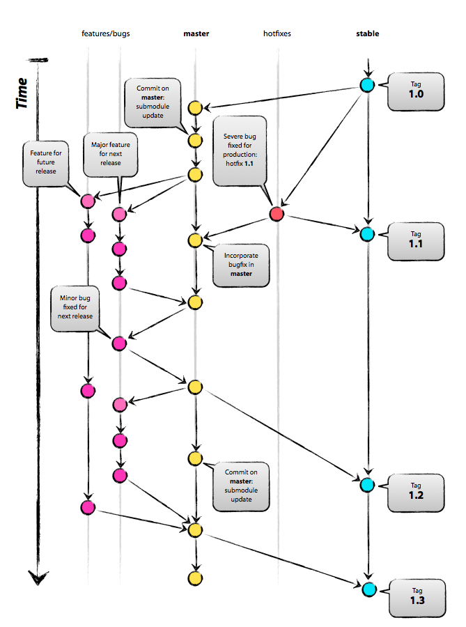
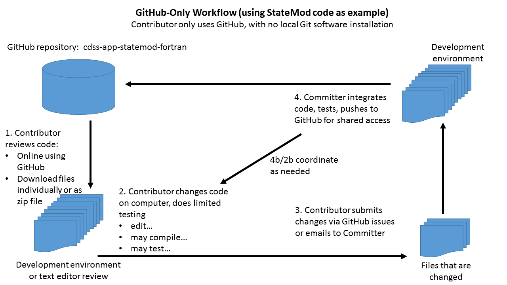
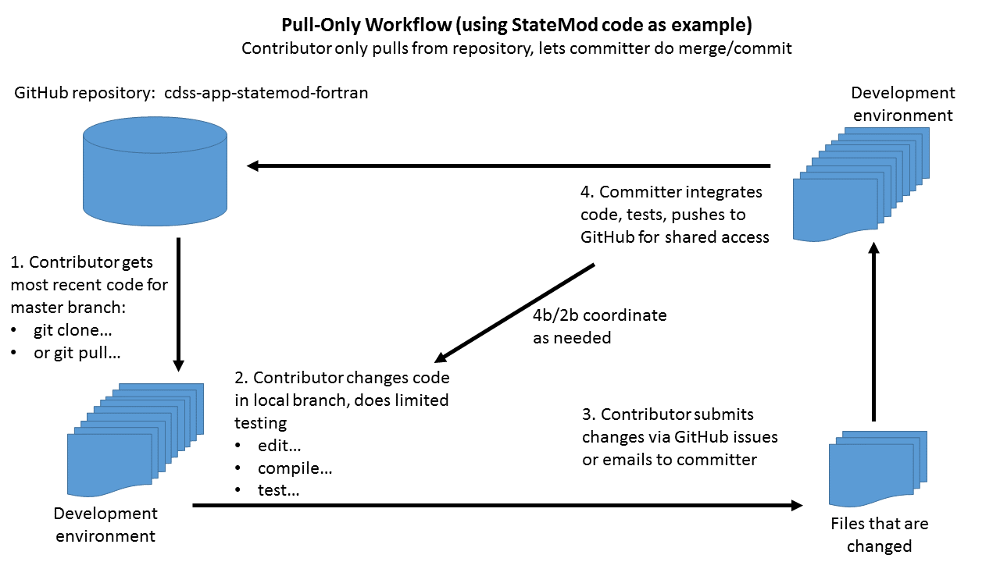

# Learn Git / Workflow Concepts #

This lesson explains Git workflow concepts.
A "workflow" is the sequence of steps used to manage content in a Git repository,
primarily dealing with the use of branches, and the processes used to branch and merge.

**Expected completion time:  30-60 minutes (depending on how much time is spent on linked resources)**

The remainder of this page consists of the following sections.

* [Workflow Overview](#workflow-overview) - workflow concepts
* [A Successful Git Branching Model](#a-successful-git-branching-model) - the popular Git workflow also called "Git Flow"
* [Feature Branching Model](#feature-branching-model) - a variant on the above, easier to implement
* [GitHub-only Workflow](#github-only-workflow) - for contributors that don't want to install and run Git software
* [Pull-Only Workflow](#pull-only-workflow) - for software developers that don't want to deal with merging into the production version
* [Forking (Pull Request) Workflow](#forking-pull-request-workflow) - supports open source contributions
* [Recommended CDSS Git Workflow](#recommended-cdss-git-workflow) - **recommended workflow for CDSS**

--------

## Workflow Overview ##

"Git workflow" is a general term that refers to how commits are managed within branches and flow into production software,
and how users/roles participate in the workflow.
The term "Git branching model" is also used. 
The concept of workflow applies to any version control, including, for example, how to create and maintain a large
document with multiple contributors.
The term "Git Flow" is also used in the industry to refer to a specific workflow with additional software tools to manage the workflow
(see:  [GitFlow](https://datasift.github.io/gitflow/IntroducingGitFlow.html)).

In the context of this CDSS documentation, the general term "Git workflow" simply refers to the strategy used by a
open source project team to maintain the files in a project.
Such a strategy may change over time as the team and projects increase in complexity.

A Git workflow must fundamentally deal with protocols for branches, including identification/naming, branching,
merging, and public-facing version identifiers.
The remaining sections of this page provide background on several Git workflow options and makes
recommendations for an approach to use in CDSS.  The following are additional resources:

* General:
	* [Git Branching - Basic Branching and Merging](https://git-scm.com/book/be/v2/Git-Branching-Basic-Branching-and-Merging) - from Git software documentation
* Atlassian (Bitbucket tutorials) - Bitbucket is an alternative to GitHub and is similar in many ways
	+ [Comparing Workflows](https://www.atlassian.com/git/tutorials/comparing-workflows)

## A Successful Git Branching Model ##

**This Git workflow is not (currently) recommended for CDSS software projects.
Instead a simpler "feature branch" workflow is recommended.
This recommendation may change after the initial CDSS open source projects have been running for awhile.**

See the following background resources:

* ["A successful Git branching mode", by Vincent Driessen](http://nvie.com/posts/a-successful-git-branching-model/) - a Git workflow
that is often referenced and used in practice
* [GitFlow](https://datasift.github.io/gitflow/IntroducingGitFlow.html) - a set of tools to implement this workflow
* Atlassian (Bitbucket tutorials) - Bitbucket is an alternative to GitHub and is similar in many ways
	+ [Gitflow Workflow](https://www.atlassian.com/git/tutorials/comparing-workflows/gitflow-workflow)

The following image summarizes this workflow:

The main reasons that this workflow is not recommended for CDSS are:

* Part-time CDSS software developers are not (yet) experts at Git and version control,
and may never be experts.
Therefore, the multiple layers of branches may be difficult to implement in practice.
* The branch naming convention requires extra work beyond Git defaults
and the meaning of the default `master` branch changes, which can lead to confusion.

The next section explains an alternate "feature branch" workflow that is simpler.

## Feature Branching Model ##

**This workflow is recommended as the primary workflow for CDSS and is [discussed further below](#recommended-cdss-git-workflow).**

The previous section presented a popular Git workflow.
However, a "feature branch" workflow is simpler and aligns with Git defaults.

* See the [Git Branching approach by Jeremy Helms](https://gist.github.com/digitaljhelms/4287848) - similar diagram to the Git Flow model
* [blackfalcon/git-feature-workflow on GitHib](https://gist.github.com/blackfalcon/8428401) - a useful tutorial for the feature branching model
* Atlassian (Bitbucket tutorials) - Bitbucket is an alternative to GitHub and is similar in many ways
	+ [Git Feature Branch Workflow](https://www.atlassian.com/git/tutorials/comparing-workflows/feature-branch-workflow)

The following are reasons why this workflow is appropriate for CDSS:

* The default `master` branch used by Git is also the main development branch,
which simplifies primary commits and remote (GitHub) synchronization.
Developers with commit permissions are entrusted to perform sufficient testing before
committing to the `master`.  Additional automated testing implemented in the OpenCDSS
effort is intended to support validation before committing to the `master` branch.
* Frequent feature, bug fix, and hotfix branches are easily created off of the `master` branch,
for example using the GitHub issue numbers for identification.
Beta releases can be created from these branches for testing, prior to committing
to the `master` branch for production release.
* Stable releases are archived as tags from the `master` branch, and, if necessary
can exist as long-running branches to maintain older software versions.
* If necessary, longer-running development branches can also be created, similar to "Git Flow"
described in the previous section.

## GitHub-only Workflow ##

**This workflow is recommended as an option for CDSS for contributors that
do not want to deal with Git software.
[See the CDSS discussion below](#recommended-cdss-git-workflow).**

The GitHub website provides features to interact with repositories without having to install Git client software
on the local computer.  This is a very simple workflow that may be appropriate in some cases,
such as when making suggestions to model datasets stored in repositories.
For example:

1. A user of CDSS data or software stored in a repository reviews the GitHub repository contents
or downloadable version of the product available on the CDSS website.
Optionally, the GitHub repository contents are downloaded by saving individual files or the repository contents zip file.
2. The user reviews the files and determines that a suggestion is appropriate.
The suggestion may be determined visually by inspection, by modifying existing files, or by creating new files. 
3. The suggestion is contributed as a GitHub issue, perhaps with an attachment for modified/new file(s).
4. A software developer with commit permissions creates a branch, implements the suggestion,
tests, and commits the changes.

In the above workflow, the person that provides input invests minimal effort in setting up a 
software development environment and learning Git.
This may be appropriate for model data sets or software code that is easily inspected.
**The contributor is essentially making suggestions and allowing the core team to integrate those suggestions.**

A more advanced workflow can be implemented if the person making contributions is entrusted with commit permissions
and is able to utilize the GitHub website features for editing.
In this case, that person can make direct changes to the repository via GitHub website features.
This is probably not desirable in most cases because the repository content generally needs to be tested
with automated tests that require extensive computer resources on a desktop computer.
This approach may be appropriate for data or documentation repositories.

## Pull-Only Workflow ##

**This workflow is recommended as an option for CDSS in cases where a contributor may
work with enhancing current code but does not want to deal with merging the enhancements into the production version.
[See the CDSS discussion below](#recommended-cdss-git-workflow).**

A more advanced workflow can be used when some contributors don't use Git client software to branch, merge, etc.,
but stick only to cloning the repository (or pulling into local version), developing content, and providing the content via the GitHub
issues, email, etc.
In this case, the developer is minimally using Git to receive the latest software version from the committers,
but is not merging their changes into master.
The workflow might look like:

1. Primary developers are entrusted with reviewing, implementing, testing, and merging contributions.
2. Contributor starts with the available GitHub `master` branch each time a new development task is needed:
	* To start with a full new copy:  Use `git clone` to clone the most recent version from the `master` branch.
	Previous clones are either first deleted, renamed, or a new folder is used for the new clone.
	* To build on a previously cloned version:  Use `git pull` to pull the most recent version from the `master` branch.
3. Make changes to the local copy.
3. Provide contributions via GitHub issue, email, etc.
4. The committer with write permissions in the repository updates the `master` branch as per step 1.
5. The contributor can run step 2 to to pull down the most recent version of the `master` branch and confirm
that their contribution was integrated.
6. Repeat the cycle for new work tasks.

In the above workflow, the contributor can choose to repeatedly clone the repository or can pull
changes into a long-running local `master` branch.
**This approach may be suitable in cases where a contributor has in-depth knowledge of the software
but does not want to spend much if any time to learning Git/GitHub.**
This workflow might get more complicated if the pull merges require interactive clean-up.
Use of software such as KDiff3 is helpful to understand code differences.

## Forking (Pull Request) Workflow ##

**This workflow is recommended as an option for CDSS in cases where open source project developers
are capable with Git/GitHub and use the pull request feature to suggest contributions.
[See the CDSS discussion below](#recommended-cdss-git-workflow).**

See the following resources:

* Atlassian (Bitbucket tutorials) - Bitbucket is an alternative to GitHub and is similar in many ways
	+ [Forking Workflow](https://www.atlassian.com/git/tutorials/comparing-workflows/forking-workflow)

A pull request workflow is one in which contributors are skilled at using Git/GitHub and
submit their contributions via "pull requests".
This approach can be used for open source projects to accept third-party contributions and can also be
used for internal team contributions if direct commits to the `master` branch by multiple
people are undesirable.  This workflow is discussed in more detail in the
[Pull Request Lesson](../10a-lesson-pull-requests/lesson-pull-requests).  The following illustrates this workflow:

1. A GitHub user (contributor) wishes to contribute to a CDSS project.  They have a GitHub account and have 
good Git/GitHub skills.
2. The contributor first forks the `master` branch to create their own copy of the repository under their GitHub account.
This repository will have a remote of the original CDSS version.
This step is necessary only if the contributor does not have write permission to the main repository,
or wants to work in a separate copy outside of the production repository.
3. The contributor will most likely then clone the repository to their local computer using Git client software.
4. The contributor will make changes to the repository as per normal Git practice, including
committing to their GitHub repository.
5. The contributor will use the GitHub pull request feature to alert the repository owners that they have
changes that can be merged.
6. The product maintainers (committers) use Git/GitHub features to review and if appropriate, merge in the changes.
Ideally this happens relatively quickly.  Otherwise the content in the contributor version becomes outdated.
The committer may ask the contributor to synchronize current `master` branch contents with the
pull request branch so that the committer has minimal code differences to review and integrate.
This may use a direct merge of the contributors content, or the committer may copy/paste changes.
Git/GitHub provide features to merge and track with commit messages.
7. Once the suggested contributions are integrated into the `master` branch, the
contributor can pull changes into their fork to have a synchronized copy and be able to move forward
with more changes..

The use of pull requests will likely increase as open source CDSS projects move forward and the
number of knowledgeable developers increases.
Pull requests may also be used internally by the core CDSS team to facilitate distributed development.

## Recommended CDSS Git Workflow ##

CDSS software products prior to the OpenCDSS effort have used a variety of version control approaches including
dated/versioned folders (e.g., StateMod and StateCU) to Git/GitHub (e.g., TSTool and StateDMI).
In all cases, a private repository for a single developer was the norm and therefore workflow did not consider
some of the issues faced by an open source project.
The following workflow approach is recommended for OpenCDSS projects, with greater Git/GitHub skill requirements at top:

* The initial OpenCDSS Git/GitHub projects will use a [Feature Branching workflow model](#feature-branching-model)
	as the primary workflow:
	+ Software developers with commit privileges will be required to have good Git/GitHub skills
	in order to perform Git workflow tasks and troubleshoot issues such as merge conflicts.
	+ The Git/GitHub `master` branch is the stable branch and is used to deploy releases.
	+ Major milestones use tags to facilitate access to older versions of code.
	+ Each bug fix or enhancement is developed by creating a feature branch corresponding to the issue number,
	for example `8-bug-xre-reporting`.
	+ Software will be tested in the feature branch before merging into the `master` branch.
	+ Primary developers/committers will merge the feature branch with the `master` branch using `merge --no-ff`.
	+ Git rebase will be evaluated once basic version control workflow is demonstrated.
* Developers that do not have Git/GitHub skills sufficient to commit to the repository will use a [Pull-only workflow](#pull-only-workflow):
	+ The core developers will handle code integration, final testing, and publishing.
	+ Secondary committers can clone or pull the `master` branch to ensure that they start with synchronized
	code and can provide suggested contributions to primary software developers via GitHub issue or email attachments.
	+ Primary developers/committers will help troubleshoot merge conflicts.
* Open source contributors can use [Forking (pull request) workflow](#forking-pull-request-workflow) to contribute to the projects:
	+ Suggestions will be made via GitHub pull request feature
	+ Primary developers/committers will perform code merges.
	+ Contributors can then pull from the `master` branch to get the integrated changes.
* Occasional contributors that have minimal Git/GitHub skills can make suggestions using a [GitHub-only workflow](#github-only-workflow)
	+ Suggestions can be made via the GitHub issues or email
	+ Primary developers/committers will follow through to integrate suggestions.

The above workflow will allow for a variety of Git/GitHub skill levels to participate in OpenCDSS software development.
Software users will have access to released versions in the form of executable programs, documentation, examples, tests, etc.
Specific examples of workflow implementation are provided in later lessons to illustrate the workflow recommendations.
