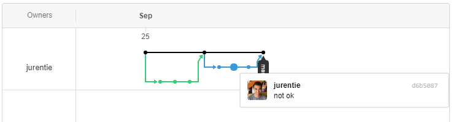

# Learn Git / Editing History

Sometimes it is necessary to edit the Git history, for example to fix a mistake from a recent commit.
Editing history is possible within practical limits but care should be taken because
of the impact to the repository and other developers.

The following is an example from StateDMI software development, but each case will require specific evaluation.

In adding to StateDMI and pushing commits to [cdss-app-statedmi-main](https://github.com/OpenWaterFoundation/cdss-app-statedmi-main) repository,
an issue arose where all of the lines in `StateDMI_Processor.java` file were committed as having been changed.
This is most likely an issue stemming from Windows `CRNL` line endings for local files versus Unix `NL` line endings stored in the repository
The `.gitattributes` file is used to help with this but sometimes line endings are still an issue.
In this case the issue may have been caused by the Eclipse Nero version not properly handling `.gitattributes` file.
The commit history also had some circularity that was confusing.
Regardless of what caused the issue, it was determined that to cleanup the issue,
it would be best to go back in history and revise the commit to reflect the lines actually edited.
This documentation walks through one example of how to discard recent commits so that the proper content can be re-applied and committed.

## Understanding the Issue ##

For simplicity, this documentation follows an example using a test repository.
Below is an example of two separate branches having been merged with master with the `--no-ff` flag to insure no fast-forward.
By doing this, GitHub's network chart can reflect commits that happened in a separate
branch and then were merged with master by being displayed on a separate line that is either green or blue.
The key is to make amends to the history, while still getting this behavior when checking the network chart.

Below is an example of the second branch merged with master having an issue in one of the commits.



## Step 1: Copy current state of the repository

To retain a backup of the history including all the edits made up to this point,
it is best to clone the repository to a safe back up location.
For example, create a backup and save it to a USB, CD, or other external device.
It is also possible to simply copy the repository to a separate folder located elsewhere on a local machine.
The decision of how securely to back up the repository will depend on how important it is to have a backup of the data.

## Step 2: Reset history

Once the current state of the repository is sufficiently backed up,
it is safe to reset the history in the repository back to the merge before the commit with an issue.
There may be more efficient ways of editing the exact commit with problems,
but the following is one option.


In the example above, the previous merge before these commits is the commit with the hash `4a3e0c3`.
This is where to reset history to. To do this use the following command:

```
$ git reset --hard 4a3e0c3
```

`--hard` is needed to ensure that the branch is reset to the given commit and changes made past that commit are discarded.
If this returns with `More?`, replace the shortened commit hash with the full hash code
because the shortened commit has is not unique.

## Step 3: Fix mistakes

Now that the branch is set back to history before there were any issues, it is possible to fix the mistakes.
As per typical branching protocols, first create a new branch.
Since the new branch will contain the content relevant to changes that have occurred,
use a name consistent with the workflow.

```
$ git checkout -b {newBranchName}
```

Once inside this new branch copy the files from the backup repository or other copy of the files.
Ensure that the content that originally caused an issue is fixed, and commit modified files to this new branch.

## Step 4: Merge/push the fix to GitHub

The following steps applies the changes to the remote repository on GitHub.

Switch to master branch: 

```
$ git checkout master
```

Merge branch with changes (no fast forward):  

```
$ git merge --no-ff {newBranchName}`
```

When pushing these changes to GitHub, `git` will try and suggest a `git pull` as necessary,
since the remote branch is now ahead of the local branch. To get around this issue, force push changes to GitHub:  

```
$ git push origin master -f
```

This should now show the revised history on GitHub, as can be seen below:  


