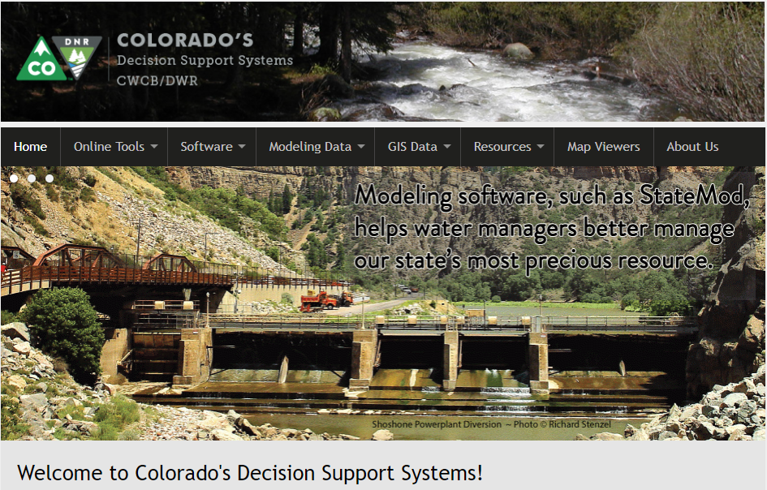

# CDSS / Learn Git

This documentation provides resources to learn how to to use the Git version control software and GitHub cloud-hosted version control,
including how to install, configure, and use Git.
The documentation is intended to provide Git and GitHub training to OpenCDSS developers who are creating, maintaining, and
enhancing CDSS software, model datasets, documents, and other electronic files that benefit from version control.

This documentation has been written based on experience using Git and GitHub at the Open Water Foundation,
and is initially focused on existing CDSS developers and users, many of whom likely do not have experience with Git and GitHub.
Experienced Git/GitHub users will benefit from sections of this documentation that focus on OpenCDSS Git/GitHub conventions.

This page of the documentation includes the following sections:

* [How to Use this Documentation](#how-to-use-this-documentation) - overview of main documentation sections
* [Colorado's Decision Support Systems (CDSS) and OpenCDSS](#colorados-decision-support-systems-cdss-and-opencdss)
* [Open Water Foundation](#open-water-foundation) - author and maintainer of this documentation
* [License](#license) - license for this documentation website
* [Source Repository on GitHub](#source-repository-on-github) - source files for this website

----------

## How to Use this Documentation

The documentation is organized in order of basic to advanced topics,
with the goal being to provide hands-on learning through a sequence of lessons.

This documentation is not intended to be a full reference for Git but focuses on important topics that
will help CDSS developers understand important technical concepts and be successful with Git within the OpenCDSS environment.
Readers of this documentation should seek to expand their skills with other resources, first-hand experience,
and learning from others.  Suggestions for this documentation can be submitted by following
instructions on the [GitHub repository web page](https://github.com/OpenWaterFoundation/cdss-learn-git).

The following main sections are included in this documentation:

* [Lesson 1 - GitHub Account](01-lesson-github-account/lesson-github-account) - set up a GitHub account in order to do the lessons
* [Lesson 2 - Version Control Concepts](02-lesson-concepts/lesson-concepts) - general version control concepts relative to CDSS and Git
* [Lesson 3 - Install Git Software](03-lesson-install/overview) - install Git software
* [Lesson 4 - Configure Git](04-lesson-config/lesson-config) - configure Git software with user settings'
* [Lesson 5 - Create a New Repository](05-lesson-new-repo/lesson-new-repo) - create a new repository on GitHub and clone to
to the local computer
* [Lesson 6 - Standard Repository Files](06-lesson-standard-repo-files/lesson-standard-repo-files) - information about standard files
used in all repositories
* [Lesson 7a - Using Git](07a-lesson-using-git/lesson-using-git) - thorough walk-through of common Git tasks (the basics)
* [Lesson 7b - GitHub Tools](07b-lesson-github-tools/lesson-github-tools) - an overview of GitHub tools
* [Lesson 7c - Difference Tools](07c-lesson-diff-tools/lesson-diff-tools) - information about file difference/comparison tools
* [Lesson 7d - StateMod Example](07d-lesson-statemod-example/lesson-statemod-example) - walk-through of StateMod software Git session
* [Lesson 7e - Dataset Example](07e-lesson-dataset-example/lesson-dataset-example) - walk-through of model dataset Git session
* [Lesson 8a - Workflow Concepts](08a-lesson-workflow-concepts/lesson-workflow-concepts) - introduction to workflow beyond the basics
* [Lesson 8b - Merge Conflicts](08b-lesson-merge-conflicts/lesson-merge-conflicts) - examples of how to deal with merge conflicts
* [Lesson 8c - Pull Requests](08c-lesson-pull-requests/lesson-pull-requests) - walk-through of a pull request
* Resources
	- [Git Resources](resources/resources) - general list of resources
	- [Git Cheatsheet](resources/git-cheatsheet) - helpful Git cheatsheets
	- [Git Glossary](resources/glossary) - glossary of Git terms
	- [Git Messages](resources/git-messages) - summary of common Git messages
	- [Git Bash](resources/git-bash) - information about using Git Bash
	- [Release Notes](resources/release-notes) - release notes for this documentation

## Colorado's Decision Support Systems (CDSS) and OpenCDSS ##

Colorado's Decision Support Systems ([CDSS, cdss.state.co.us](http://cdss.state.co.us))
has been developed to answer important questions about Colorado's water resources.
CDSS efforts are led by the [Colorado Water Conservation Board (CWCB)](http://cwcb.state.co.us)
and [Colorado Division of Water Resources (DWR)](http://water.state.co.us).

Primary CDSS components include the StateCU consumptive use model, which estimates irrigation water requirements and other demands,
and the StateMod water allocation model, which simulates river basins to support water resources planning.
The software source code and model dataset files are important electronic assets that need to be properly maintained.

In late 2016, the Open Water Foundation began the effort to move CDSS software to open source licensing
and establish open source software projects.
This effort is called "OpenCDSS" and will result in a new paradigm for maintaining and enhancing CDSS resources.
Best practices for OpenCDSS, such as using Git and GitHub for version control, are being implemented.
This documentation is the result of such efforts.

## Open Water Foundation ##

The Open Water Foundation (OWF, [openwaterfoundation.org](http://openwaterfoundation.org)) is a 501(c)3 social enterprise
nonprofit that focuses on developing and supporting open source software to make better
decisions about water resources.  OWF is providing technical resources and management to
transition CDSS software to sustainable open source projects.

See also other [OWF learning resources](http://learn.openwaterfoundation.org).

## License

The licenses for CDSS resources are being determined as part of the OpenCDSS project.

## Source Repository on GitHub

The source files for this documentation are maintained in a GitHub repository:  [cdss-learn-git](https://github.com/OpenWaterFoundation/cdss-learn-git).
This repository may be moved to a State of Colorado GitHub account in the future.

This documentation is prepared using MkDocs.  For full MkDocs documentation visit [mkdocs.org](http://mkdocs.org/).
