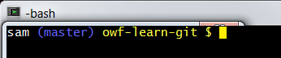

# Learn Git / Git Resources / Git Bash (Shell) #

This documentation includes the following sections related to using Git from
Git Bash or other command shell:

* [Git Bash Commands](#git-bash-commands)
* [Bash Git Utilities](#bash-git-utilities)
	+ [Auto-Completion with `git-completion.bash`](#auto-completion-with-git-completionbash)
	+ [Set Prompt to Indicate Repository Information with `git-prompt.sh`](#set-prompt-to-indicate-repository-information-with-git-promptsh)
* [`git-check.sh`](#git-checksh)

---------------------

## Git Bash Commands ##

Git Bash is installed with Git for Windows and provides access to the `git` command.
Git Bash is a Linux-like shell and Linux commands may not be familiar to Windows users.
Git Bash provides many useful commands that can be helpful when running `git` from the command line and manipulating files.
The following table summarizes useful Git Bash commands.

Command | Description
----------|----------------------------
`cp file1 file2` | copy `file` to `file2` where each can be a path
`exit` | exit the Git Bash shell
`ls` | list files and folders in the current folder
`ls -a` | list all files in the current folder, including hidden files and folders such as `.git`
`list folder` | list the contents of the specified folder
`pwd` | display the "present working directory" path, useful when the full path is not shown in the prompt
`rm file` | remove `file`
`rmdir folder` | remove a folder (directory)

## Bash Git Utilities ##

The following are useful `bash` utilities to enhance the Git experience.
The utilities will need to be configured in each independent development environment,
for example for Cygwin, Linux, Git Bash, and each virtual machine that may be configured.
**These utilities are automatically installed in some tools (such as Git for Windows Git Bash) but need to be installed in others.**

Use of the `git-completion.sh` and `git-prompt.sh` tools is described in the following Udacity Git training course:
[Udacity:  How to Use Git and GitHub](https://www.udacity.com/course/how-to-use-git-and-github--ud775)

The `git-completion` and `git-prompt` scripts can be enabled in the software developer's
`.bashrc` file (executed for interactive shells),
where the `.bashrc` should be sourced from the `.bash_profile` or `.profile`.
The following calls the `git-completion.bash` and `git-prompt.sh`
scripts that are described in the following subsections.
The following example illustrates saving the scripts in the user's `~/home/bin` folder but the
scripts could also be named with a leading period and be saved in the home folder as a hidden file
(developer needs to decide how to configure their environment).
Local modifications can be made by the developer, for example to customize the prompt content and colors.
Git for Windows (Git Bash) may already include the following scripts
and therefore modifications are only needed if default behavior is not as desired.

The functionality has been tested in Cygwin, Git Bash, and Debian Linux.

On Debian Linux, the following can be inserted in the `.profile` (may be included by default):

```sh
# if running bash
if [ -n "$BASH_VERSION" ]; then
    # include .bashrc if it exists
    if [ -f "$HOME/.bashrc" ]; then
        . "$HOME/.bashrc"
    fi
fi

```

Then insert the following in the `.bashrc` file:

```sh
# Start Git utilities insert
# Enable tab completion for Git commands
source ~/bin/git-completion.bash

# Enable git-aware command prompt.
# See:  http://tldp.org/HOWTO/Bash-Prompt-HOWTO/x329.html
# https://tiswww.case.edu/php/chet/bash/bashref.html#Controlling-the-Prompt
cyan="\[\033[0;36m\]"
blue="\[\033[0;34m\]"
green="\[\033[0;32m\]"
lightblue="\[\033[1;34m\]"
pink="\[\033[0;31m\]"
purple="\[\033[0;35m\]"
white="\[\033[1;37m\]"
yellow="\[\033[1;33m\]"
# reset switches back to regular color
reset="\[\033[0m\]"

# Change command prompt to display the current Git branch and whether any changes have been made
source ~/bin/git-prompt.sh
export GIT_PS1_SHOWDIRTYSTATE=1
# '\u' adds the name of the current user to the prompt
# '\$(__git_ps1)' adds git-related stuff
# '\W' adds the name of the current directory
# Prompt will be:
#  user (branch) directory $
# where branch may be followed by:
#  * if unstaged files
#  + if staged files
export PS1="$white\u$lightblue\$(__git_ps1)$yellow \W $ $reset"
# End Git utilities insert
```

The resulting command prompt appears similar to the following:



### Auto-Completion with `git-completion.bash` ###

The complete example in the previous section uses the `git-completion.sh` script
to enable auto-completion of Git commands.  See the following original source describing this script:

* [git-completion.bash](https://github.com/git/git/blob/master/contrib/completion/git-completion.bash)


### Set Prompt to Indicate Repository Information with `git-prompt.sh` ###

It can be confusing to know what branch is being edited with command-line tools,
especially after being away from a project for awhile.  The `git-prompt` bash script provides context 
by showing the Git branch in the shell prompt.
The following provides the original `git-prompt.sh` script:

* [git-prompt.sh](https://github.com/git/git/blob/master/contrib/completion/git-prompt.sh)

## `git-check.sh` ##

The `git-check.sh` script has been created to help Git users more easily understand when a repository
needs to be pulled, pushed, or has local changes.
The script is particularly useful in cases where multiple repositories are involved such as TSTool software.

### Install and Configure `git-check.sh` ###

To install and configure script:

1. Install the script in the `build-util` folder under the main repository for a product 
by copying the script from another repository, such as TSTool main code.
The script is not needed for all repositories, although it can be used if desired.
See the [`git-check.sh` script](https://github.com/OpenWaterFoundation/cdss-learn-git/tree/master/build-util/git-check.sh) for this documentation repository.
2. Create a file named `product-repo-list.txt` in the `build-util` folder, containing a list of repositories that are to be checked.
See the [`product-repo-list.txt` file](https://github.com/OpenWaterFoundation/cdss-learn-git/tree/master/build-util/product-repo-list.txt) for this documentation repository.
3. Edit the script to change the product information.
These definitions are near the bottom of the file.

### Run `git-check.sh` ###

Run the script to see whether any remote commits have been made, whether any local work has been committed but not pushed,
or local working files have been edited and need to be committed.
Take actions based on the output until all repositories are "up to date".

The script assumes a standard folder structure recommended for CDSS development.
The script can be updated to accommodate other folder structures.
Although it is possible to rely on a shared version of this script,
it is being installed in each major repository to ensure that it works with the specific repository
without an additional dependency.

The bottom of output provides a summary of the status of each repository.
If any action is needed, scroll up to see the output for the specific repository.
The script also checks for whether repositories have been cloned using Windows or Linux approach for filemode,
which impacts handling of executable files such as scripts.
Consequently, the script can help confirm that all repositories in a development environment are handled
with consistent tools.

```
operatingSystem=mingw (used to check for Cygwin)
================================================================================
Checking status of repo:  cdss-app-statemod-fortran
Fetching origin
------------------
Up-to-date
------------------
USE Git Bash or other Windows git client with this repo (filemode=false).
================================================================================
Checking status of repo:  cdss-app-statemod-fortran-doc-dev
Fetching origin
------------------
Up-to-date
------------------
USE Git Bash or other Windows git client with this repo (filemode=false).
================================================================================
Checking status of repo:  cdss-app-statemod-fortran-doc-user
Fetching origin
------------------
Up-to-date
------------------
USE Git Bash or other Windows git client with this repo (filemode=false).
================================================================================
Checking status of repo:  cdss-app-statemod-fortran-test
Fetching origin
------------------
Up-to-date
Working files contain modified files that need to be committed, or staged files.
Working files contain 4 untracked files that need to be committed.
------------------
USE Git Bash or other Windows git client with this repo (filemode=false).
================================================================================
Number of up-to-date repositories:                                        4
Number of 'need to pull' repositories (remote commits available):         0
Number of 'need to push' repositories (local commits saved):              0
Number of diverged repositories (need to pull and push):                  0
Number of repositories with local changes (working and/or staged files):  1
================================================================================
```

### Troubleshooting `git-check.sh` ###

The `git-check.sh` script can sometimes indicate that there are changes in working files even
though `git status` does not list anything.  The following are possible causes:

1. Because the script is run from one shell, if any of the repositories were cloned
using a different shell environment such as mixing Cygwin with Git Bash,
it is possible that the end of line handling is resulting in differences if
`git-check.sh` is run in an inconsistent shell.
To address, it is necessary to re-clone the repository to make sure that the same
environment is used for all.  For example, pick Git Bash as the primary environment.
2. If an empty folder is created in working files, this will be indicated as changes
to the working files.  However, `git status` will not list empty folders.
To detect the empty folder, run the following in the repository working files
with the issue:  `git ls-files -o --directory --exclude-standard`
